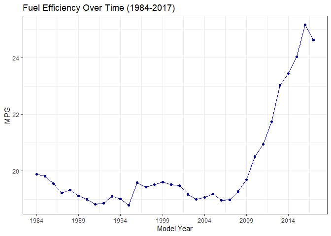
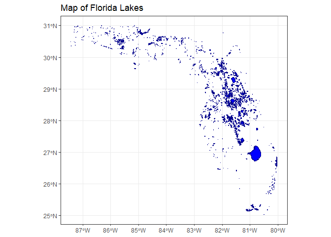
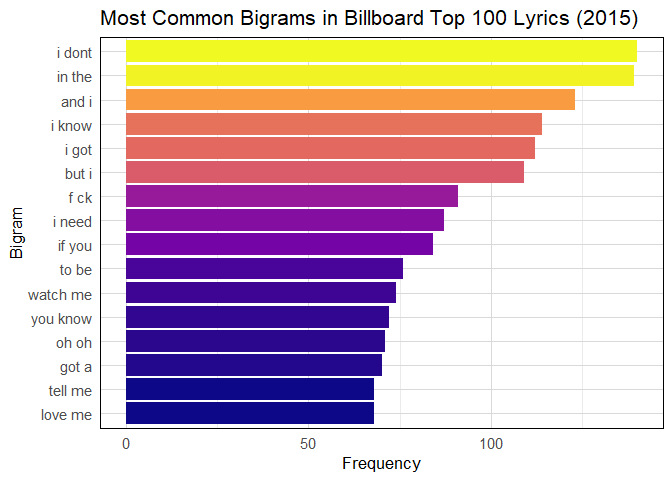

# Data Visualization and Reproducible Research

> Zachary Moonab 

## Project 01

In the `project_01/` folder you can find that I explored how different vehicle characteristics affect fuel efficiency using data from the 
U.S. Department of Energy. I created several visualizations to examine trends across vehicle class, engine size, model year, and transmission type. The 
charts showed that sedans and smaller vehicles tend to be more fuel-efficient than larger vehicles like trucks and vans. Cars with bigger engines generally 
have lower miles per gallon (MPG), indicating they use more fuel. Over time, average fuel efficiency has gradually improved, suggesting advancements in 
automotive technology and increased focus on sustainability. I also compared different transmission types and found that some offer better fuel economy than 
others. To improve clarity and readability, I used color schemes to highlight trends, adjusted text formatting, removed outliers where appropriate, and made 
sure each chart had informative titles and labels. This project helped me develop skills in R and data visualization while deepening my understanding of how 
car design impacts fuel consumption.

**Sample data visualization:** 

## Project 02

In this project, I explored For Mini-Project 02, I explored multiple data visualization techniques using datasets related to U.S. births and geographic 
features in Florida. The project involved creating a map of Florida lakes using shapefiles, an interactive line chart showing baby name popularity over 
time, and a time series plot of daily U.S. births from 2000 to 2014. Each visualization required a different approach, helping me build skills in 
handling spatial, categorical, and temporal data. I used read_sf() and geom_sf() to generate the lake map, plot_ly() for the interactive baby names chart, 
and ggplot2 to plot the births data. While working on the time series plot, I encountered several challenges such as incorrect data types and smoothing errors.
I resolved these by converting character columns to numeric, switching from loess to gam for smoothing, and summarizing the data monthly to reduce overplotting. 
My results revealed trends like the decline in certain baby names after the early 2000s and a dip in U.S. births following the 2008 financial crisis. 
I also followed good visualization practices by using clear labels, minimalist themes, and color to distinguish between raw data and smoothed trends. 
Overall, this project deepened my understanding of data cleaning and reinforced the importance of choosing the right visual approach to make patterns in 
data more understandable. Find the code and report in the `project_02/` folder.

**Sample data visualization:** 

## Project 03

For Mini-Project 03, I recreated a series of data visualizations using a weather dataset from Tampa, Florida (2022) and a Billboard Top 100 lyrics 
dataset from 2015. The first part of the project focused on exploratory data analysis of temperature and precipitation data. 
I began by cleaning and formatting the weather dataset using tools from the tidyverse, such as mutate(), unite(), and ymd(), to prepare the variables for 
plotting. I created a variety of plots, including faceted histograms of daily maximum temperatures by month, a density plot of all maximum temperatures, 
a monthly faceted density plot, and a ridgeline plot that used gradient coloring to visualize temperature distributions over the year. These 
visualizations provided insight into seasonal temperature patterns in Tampa, with summer months showing higher average maximum temperatures and greater 
spread. I also created a custom bar chart summarizing total monthly precipitation, which helped highlight that precipitation was unevenly distributed 
throughout the year, with certain months receiving significantly more rainfall.

In the second part of the project, I analyzed the lyrics of Billboard’s Top 100 songs from 2015 by identifying the most common bigrams, or two-word 
phrases. I used the unnest_tokens() function from the tidytext package to break down song lyrics into bigrams, then counted and sorted them by frequency. 
After filtering for the top 15 most common phrases, I created a horizontal bar chart using ggplot2 that visualized how frequently each bigram appeared 
across all songs. The most frequent bigrams included conversational phrases like “I don’t,” “in the,” and “I know,” reflecting common themes and language 
patterns in pop music lyrics. Through this part of the project, I gained practice in text mining and found it interesting to connect linguistic trends to 
popular culture. Overall, this project demonstrated the power of data visualization in both quantitative (weather) and qualitative (lyrics) contexts, and 
helped me strengthen my ability to clean, transform, and present data clearly using R.

**Sample data visualization:** 

### Moving Forward

Throughout this course, I’ve gained a much stronger understanding of how to turn raw data into meaningful visual stories. I learned how important it is 
to clean and structure data properly, how to choose the right type of chart for the message I want to convey, and how to make my visualizations more 
accessible and readable using good design practices. I also became more confident using tools like ggplot2, plotly, sf, and tidytext, as well as the 
basics of reproducible workflows with RMarkdown and GitHub.

Moving forward, I want to continue developing my skills in data storytelling and explore how interactivity and animation can make visualizations even 
more engaging. I’m also interested in learning more about dashboard tools like Shiny, and practicing how to explain technical findings to non-technical 
audiences. Ultimately, I hope to use data visualization not just to analyze information, but to communicate insights in a way that sparks curiosity, 
informs decisions, and inspires action.