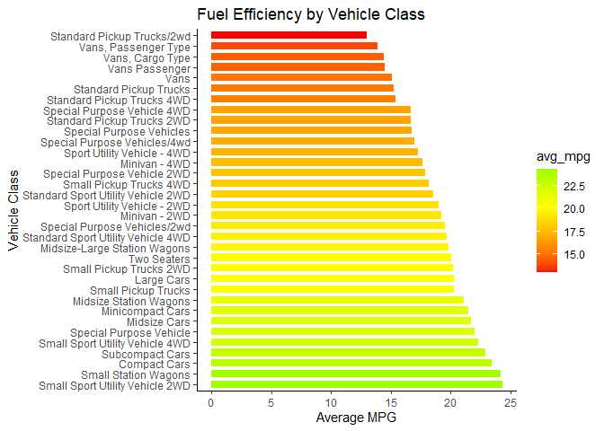
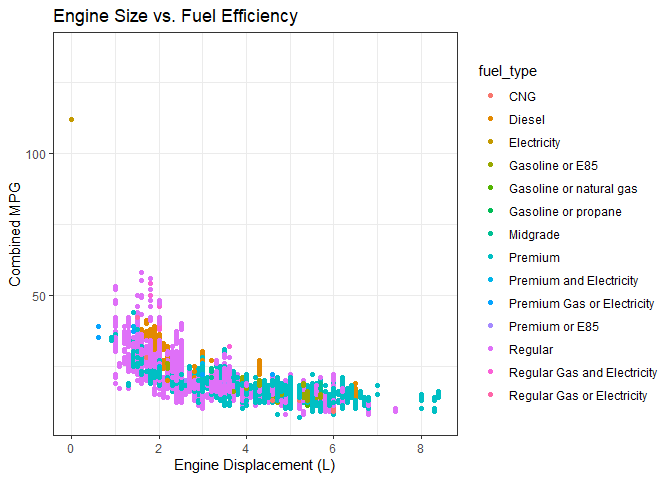
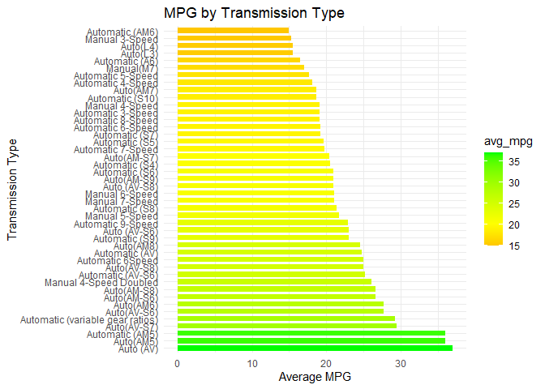

# Data Visualization Project 01


``` r
library(tidyverse)
```


``` r
fuel <- read.csv("https://raw.githubusercontent.com/aalhamadani/datasets/main/fuel.csv")
str(fuel)
```

```
## 'data.frame':	38113 obs. of  81 variables:
##  $ vehicle_id                       : int  26587 27705 26561 27681 27550 28426 27549 28425 27593 28455 ...
##  $ year                             : int  1984 1984 1984 1984 1984 1984 1984 1984 1984 1984 ...
##  $ make                             : chr  "Alfa Romeo" "Alfa Romeo" "Alfa Romeo" "Alfa Romeo" ...
##  $ model                            : chr  "GT V6 2.5" "GT V6 2.5" "Spider Veloce 2000" "Spider Veloce 2000" ...
##  $ class                            : chr  "Minicompact Cars" "Minicompact Cars" "Two Seaters" "Two Seaters" ...
##  $ drive                            : chr  NA NA NA NA ...
##  $ transmission                     : chr  "Manual 5-Speed" "Manual 5-Speed" "Manual 5-Speed" "Manual 5-Speed" ...
##  $ transmission_type                : chr  NA NA NA NA ...
##  $ engine_index                     : int  9001 9005 9002 9006 1830 1880 1831 1881 1524 1574 ...
##  $ engine_descriptor                : chr  "(FFS)" "(FFS) CA model" "(FFS)" "(FFS) CA model" ...
##  $ engine_cylinders                 : int  6 6 4 4 4 4 6 6 6 6 ...
##  $ engine_displacement              : num  2.5 2.5 2 2 2.5 2.5 4.2 4.2 4.2 4.2 ...
##  $ turbocharger                     : logi  NA NA NA NA NA NA ...
##  $ supercharger                     : logi  NA NA NA NA NA NA ...
##  $ fuel_type                        : chr  "Regular" "Regular" "Regular" "Regular" ...
##  $ fuel_type_1                      : chr  "Regular Gasoline" "Regular Gasoline" "Regular Gasoline" "Regular Gasoline" ...
##  $ fuel_type_2                      : logi  NA NA NA NA NA NA ...
##  $ city_mpg_ft1                     : int  17 17 18 18 18 18 13 13 15 15 ...
##  $ unrounded_city_mpg_ft1           : num  0 0 0 0 0 0 0 0 0 0 ...
##  $ city_mpg_ft2                     : int  0 0 0 0 0 0 0 0 0 0 ...
##  $ unrounded_city_mpg_ft2           : num  0 0 0 0 0 0 0 0 0 0 ...
##  $ city_gasoline_consumption_cd     : num  0 0 0 0 0 0 0 0 0 0 ...
##  $ city_electricity_consumption     : num  0 0 0 0 0 0 0 0 0 0 ...
##  $ city_utility_factor              : num  0 0 0 0 0 0 0 0 0 0 ...
##  $ highway_mpg_ft1                  : int  24 24 25 25 17 17 13 13 20 19 ...
##  $ unrounded_highway_mpg_ft1        : num  0 0 0 0 0 0 0 0 0 0 ...
##  $ highway_mpg_ft2                  : int  0 0 0 0 0 0 0 0 0 0 ...
##  $ unrounded_highway_mpg_ft2        : num  0 0 0 0 0 0 0 0 0 0 ...
##  $ highway_gasoline_consumption_cd  : num  0 0 0 0 0 0 0 0 0 0 ...
##  $ highway_electricity_consumption  : num  0 0 0 0 0 0 0 0 0 0 ...
##  $ highway_utility_factor           : num  0 0 0 0 0 0 0 0 0 0 ...
##  $ unadjusted_city_mpg_ft1          : num  21 21 23 23 22 22 16 16 19 19 ...
##  $ unadjusted_highway_mpg_ft1       : num  34 34 35 35 24 24 18 18 27 26 ...
##  $ unadjusted_city_mpg_ft2          : num  0 0 0 0 0 0 0 0 0 0 ...
##  $ unadjusted_highway_mpg_ft2       : num  0 0 0 0 0 0 0 0 0 0 ...
##  $ combined_mpg_ft1                 : int  20 20 21 21 17 17 13 13 17 17 ...
##  $ unrounded_combined_mpg_ft1       : num  0 0 0 0 0 0 0 0 0 0 ...
##  $ combined_mpg_ft2                 : int  0 0 0 0 0 0 0 0 0 0 ...
##  $ unrounded_combined_mpg_ft2       : num  0 0 0 0 0 0 0 0 0 0 ...
##  $ combined_electricity_consumption : num  0 0 0 0 0 0 0 0 0 0 ...
##  $ combined_gasoline_consumption_cd : num  0 0 0 0 0 0 0 0 0 0 ...
##  $ combined_utility_factor          : num  0 0 0 0 0 0 0 0 0 0 ...
##  $ annual_fuel_cost_ft1             : int  1750 1750 1650 1650 2050 2050 2700 2700 2050 2050 ...
##  $ annual_fuel_cost_ft2             : int  0 0 0 0 0 0 0 0 0 0 ...
##  $ gas_guzzler_tax                  : logi  NA NA NA NA NA NA ...
##  $ save_or_spend_5_year             : int  -2000 -2000 -1500 -1500 -3500 -3500 -6750 -6750 -3500 -3500 ...
##  $ annual_consumption_in_barrels_ft1: num  16.5 16.5 15.7 15.7 19.4 ...
##  $ annual_consumption_in_barrels_ft2: num  0 0 0 0 0 0 0 0 0 0 ...
##  $ tailpipe_co2_ft1                 : int  -1 -1 -1 -1 -1 -1 -1 -1 -1 -1 ...
##  $ tailpipe_co2_in_grams_mile_ft1   : num  444 444 423 423 523 ...
##  $ tailpipe_co2_ft2                 : int  -1 -1 -1 -1 -1 -1 -1 -1 -1 -1 ...
##  $ tailpipe_co2_in_grams_mile_ft2   : num  0 0 0 0 0 0 0 0 0 0 ...
##  $ fuel_economy_score               : int  -1 -1 -1 -1 -1 -1 -1 -1 -1 -1 ...
##  $ ghg_score                        : int  -1 -1 -1 -1 -1 -1 -1 -1 -1 -1 ...
##  $ ghg_score_alt_fuel               : int  -1 -1 -1 -1 -1 -1 -1 -1 -1 -1 ...
##  $ my_mpg_data                      : chr  "N" "N" "N" "N" ...
##  $ x2d_passenger_volume             : int  74 74 0 0 0 0 0 0 0 0 ...
##  $ x2d_luggage_volume               : int  7 7 0 0 0 0 0 0 0 0 ...
##  $ x4d_passenger_volume             : int  0 0 0 0 0 0 0 0 0 0 ...
##  $ x4d_luggage_volume               : int  0 0 0 0 0 0 0 0 0 0 ...
##  $ hatchback_passenger_volume       : int  0 0 0 0 0 0 0 0 0 0 ...
##  $ hatchback_luggage_volume         : int  0 0 0 0 0 0 0 0 0 0 ...
##  $ start_stop_technology            : logi  NA NA NA NA NA NA ...
##  $ alternative_fuel_technology      : chr  NA NA NA NA ...
##  $ electric_motor                   : logi  NA NA NA NA NA NA ...
##  $ manufacturer_code                : logi  NA NA NA NA NA NA ...
##  $ gasoline_electricity_blended_cd  : logi  FALSE FALSE FALSE FALSE FALSE FALSE ...
##  $ vehicle_charger                  : logi  NA NA NA NA NA NA ...
##  $ alternate_charger                : logi  NA NA NA NA NA NA ...
##  $ hours_to_charge_120v             : int  0 0 0 0 0 0 0 0 0 0 ...
##  $ hours_to_charge_240v             : num  0 0 0 0 0 0 0 0 0 0 ...
##  $ hours_to_charge_ac_240v          : num  0 0 0 0 0 0 0 0 0 0 ...
##  $ composite_city_mpg               : int  0 0 0 0 0 0 0 0 0 0 ...
##  $ composite_highway_mpg            : int  0 0 0 0 0 0 0 0 0 0 ...
##  $ composite_combined_mpg           : int  0 0 0 0 0 0 0 0 0 0 ...
##  $ range_ft1                        : int  0 0 0 0 0 0 0 0 0 0 ...
##  $ city_range_ft1                   : num  0 0 0 0 0 0 0 0 0 0 ...
##  $ highway_range_ft1                : num  0 0 0 0 0 0 0 0 0 0 ...
##  $ range_ft2                        : logi  NA NA NA NA NA NA ...
##  $ city_range_ft2                   : num  0 0 0 0 0 0 0 0 0 0 ...
##  $ highway_range_ft2                : num  0 0 0 0 0 0 0 0 0 0 ...
```

# Bar Chart: Average MPG by Vehicle Class

``` r
fuel %>%
  group_by(class) %>%
  summarize(avg_mpg = mean(combined_mpg_ft1)) %>%
  ggplot(aes(x = reorder(class, -avg_mpg), y = avg_mpg, fill = avg_mpg)) +
  geom_col(width = 0.7) +
  scale_fill_gradient2(low = "red", mid = "yellow", high = "green", midpoint = mean(fuel$combined_mpg_ft1)) +
  labs(title = "Fuel Efficiency by Vehicle Class",
       x = "Vehicle Class",
       y = "Average MPG") +
  theme_classic() +
  coord_flip()
```

<!-- -->

# Scatter Plot: Engine Displacement vs. Average MPG

``` r
ggplot(fuel, aes(x = engine_displacement, y = combined_mpg_ft1, color = fuel_type)) +
  geom_point() +
  labs(title = "Engine Size vs. Fuel Efficiency",
       x = "Engine Displacement (L)",
       y = "Combined MPG") +
  theme_bw()
```

```
## Warning: Removed 134 rows containing missing values or values outside the scale range
## (`geom_point()`).
```

<!-- -->

# Line Plot: MPG Over Time 

``` r
fuel %>%
  group_by(year) %>%
  summarize(avg_mpg = mean(combined_mpg_ft1)) %>%
  ggplot(aes(x = year, y = avg_mpg)) +
  geom_line(color = "blue") +
  geom_point(color = "darkblue") +
  labs(title = "Fuel Efficiency Over Time (1984-2017)",
       x = "Model Year",
       y = "MPG") +
  scale_x_continuous(breaks = seq(min(fuel$year), max(fuel$year), by = 5)) +
  theme_bw()
```

<!-- -->

# Bar Chart: MPG Versus Types of Transmissions

``` r
fuel %>%
  group_by(transmission) %>%
  summarize(avg_mpg = mean(combined_mpg_ft1)) %>%
  arrange(desc(avg_mpg)) %>%              
  slice(-c(1)) %>%                            
  filter(avg_mpg != max(avg_mpg),               
         avg_mpg != min(avg_mpg)) %>%           
  ggplot(aes(x = reorder(transmission, -avg_mpg), y = avg_mpg, fill = avg_mpg)) +
  geom_col(width = 0.7) +
  scale_fill_gradient2(low = "red", mid = "yellow", high = "green",
                       midpoint = mean(fuel$combined_mpg_ft1)) +
  labs(title = "MPG by Transmission Type",
       x = "Transmission Type",
       y = "Average MPG") +
  theme_minimal() +
  coord_flip() 
```

<!-- -->
