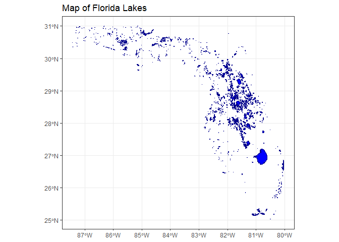
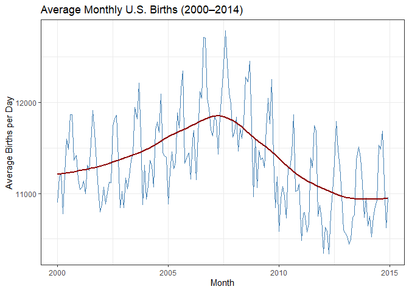

# Data Visualization Project 02

### Part A


``` r
library(tidyverse)
```

```
## ── Attaching core tidyverse packages ──────────────────────── tidyverse 2.0.0 ──
## ✔ dplyr     1.1.4     ✔ readr     2.1.5
## ✔ forcats   1.0.0     ✔ stringr   1.5.1
## ✔ ggplot2   3.5.2     ✔ tibble    3.2.1
## ✔ lubridate 1.9.4     ✔ tidyr     1.3.1
## ✔ purrr     1.0.4     
## ── Conflicts ────────────────────────────────────────── tidyverse_conflicts() ──
## ✖ dplyr::filter() masks stats::filter()
## ✖ dplyr::lag()    masks stats::lag()
## ℹ Use the conflicted package (<http://conflicted.r-lib.org/>) to force all conflicts to become errors
```

``` r
library(sf)
```

```
## Linking to GEOS 3.13.1, GDAL 3.11.0, PROJ 9.6.0; sf_use_s2() is TRUE
```

``` r
library(leaflet)
library(plotly)
```

```
## 
## Attaching package: 'plotly'
## 
## The following object is masked from 'package:ggplot2':
## 
##     last_plot
## 
## The following object is masked from 'package:stats':
## 
##     filter
## 
## The following object is masked from 'package:graphics':
## 
##     layout
```

``` r
getwd()
```

```
## [1] "C:/Users/zmoon/Downloads/Moonab_Zachary_data_viz_final_project-main/Moonab_Zachary_data_viz_final_project-main/project-02"
```

``` r
library(here)
```

```
## here() starts at C:/Users/zmoon/Downloads/Moonab_Zachary_data_viz_final_project-main/Moonab_Zachary_data_viz_final_project-main
```

``` r
florida_lakes <- read_sf(here("data", "Florida_Lakes.shp"))
baby_names <- readRDS(here("data", "babynames.rds"))
births <- read_sf(here("data", "us_births_00_14.csv"))
str(baby_names)
```

```
## tibble [1,924,665 × 5] (S3: tbl_df/tbl/data.frame)
##  $ year: num [1:1924665] 1880 1880 1880 1880 1880 1880 1880 1880 1880 1880 ...
##  $ sex : chr [1:1924665] "F" "F" "F" "F" ...
##  $ name: chr [1:1924665] "Mary" "Anna" "Emma" "Elizabeth" ...
##  $ n   : int [1:1924665] 7065 2604 2003 1939 1746 1578 1472 1414 1320 1288 ...
##  $ prop: num [1:1924665] 0.0724 0.0267 0.0205 0.0199 0.0179 ...
```

``` r
head(baby_names)
```

```
## # A tibble: 6 × 5
##    year sex   name          n   prop
##   <dbl> <chr> <chr>     <int>  <dbl>
## 1  1880 F     Mary       7065 0.0724
## 2  1880 F     Anna       2604 0.0267
## 3  1880 F     Emma       2003 0.0205
## 4  1880 F     Elizabeth  1939 0.0199
## 5  1880 F     Minnie     1746 0.0179
## 6  1880 F     Margaret   1578 0.0162
```


``` r
ggplot(florida_lakes) +
  geom_sf(fill = "blue", color = "darkblue") +
  theme_bw() +
  labs(title = "Map of Florida Lakes")
```

<!-- -->

### Part B


``` r
selected_names <- c("Jared", "Zachary", "Matthew", "Brandon", "Alexander", "Walter" )
plot_data <- baby_names %>%
  filter(name %in% selected_names)
p <- plot_ly()
for (name in selected_names) {
  name_data <- plot_data %>% filter(name == !!name)
  p <- add_trace(
    p,
    x = name_data$year,
    y = name_data$prop,
    type = 'scatter',
    mode = 'lines',
    name = name,
    visible = name == "Mary")
}
p <- layout(p,
  title = "Popularity of Baby Names Over Time",
  xaxis = list(title = "Year"),
  yaxis = list(title = "Proportion"),
  updatemenus = list(
    list(
      buttons = lapply(selected_names, function(nm) {
      list(
          method = "update",
          args = list(list(visible = selected_names == nm)),
          label = nm )}), direction = "down", showactive = TRUE))) 
p
```

```{=html}
<div class="plotly html-widget html-fill-item" id="htmlwidget-7ef0086d5ab8fadee60b" style="width:672px;height:480px;"></div>
<script type="application/json" data-for="htmlwidget-7ef0086d5ab8fadee60b">{"x":{"visdat":{"6d3c6f2e56f8":["function () ","plotlyVisDat"]},"cur_data":"6d3c6f2e56f8","attrs":{"6d3c6f2e56f8":{"alpha_stroke":1,"sizes":[10,100],"spans":[1,20],"x":[1881,1891,1910,1912,1913,1914,1915,1916,1917,1918,1919,1920,1921,1922,1923,1924,1925,1926,1927,1928,1929,1930,1931,1932,1933,1934,1935,1936,1937,1938,1939,1940,1941,1942,1943,1944,1945,1946,1947,1948,1949,1950,1951,1952,1953,1954,1955,1956,1957,1958,1959,1960,1961,1962,1963,1964,1965,1966,1967,1968,1969,1970,1970,1971,1972,1972,1973,1973,1974,1974,1975,1975,1976,1976,1977,1977,1978,1978,1979,1979,1980,1980,1981,1981,1982,1982,1983,1983,1984,1984,1985,1985,1986,1986,1987,1987,1988,1988,1989,1989,1990,1990,1991,1991,1992,1992,1993,1993,1994,1994,1995,1995,1996,1996,1997,1997,1998,1998,1999,1999,2000,2000,2001,2001,2002,2002,2003,2003,2004,2004,2005,2005,2006,2006,2007,2007,2008,2009,2009,2010,2010,2011,2012,2013,2014,2014,2015,2016,2017],"y":[4.6180000000000002e-05,4.5760000000000002e-05,2.3980000000000001e-05,1.329e-05,9.3200000000000006e-06,8.7800000000000006e-06,1.7030000000000001e-05,1.2999999999999999e-05,1.5639999999999999e-05,1.1440000000000001e-05,1.083e-05,9.9899999999999992e-06,9.6700000000000006e-06,7.1099999999999997e-06,1.325e-05,1.6249999999999999e-05,9.55e-06,9.5999999999999996e-06,1.5489999999999999e-05,1.577e-05,1.4450000000000001e-05,2.1250000000000002e-05,1.8700000000000001e-05,1.6759999999999999e-05,1.3730000000000001e-05,1.507e-05,2.1509999999999999e-05,2.349e-05,3.4749999999999998e-05,4.0479999999999999e-05,3.7950000000000001e-05,2.8670000000000002e-05,3.985e-05,3.1250000000000001e-05,3.3689999999999998e-05,2.9519999999999999e-05,2.6250000000000001e-05,2.6659999999999999e-05,2.3689999999999998e-05,2.8050000000000001e-05,2.5530000000000001e-05,3.5179999999999999e-05,2.8249999999999999e-05,2.887e-05,2.9980000000000001e-05,4.3510000000000002e-05,3.2539999999999997e-05,3.7299999999999999e-05,3.383e-05,3.6229999999999997e-05,3.3699999999999999e-05,2.8629999999999999e-05,3.4789999999999997e-05,3.6159999999999999e-05,4.3579999999999999e-05,3.9950000000000002e-05,5.2240000000000001e-05,0.00014247000000000001,0.00019609,0.00029278000000000003,0.00037487000000000002,2.7300000000000001e-06,0.00039251999999999999,0.00059009000000000004,3.1e-06,0.00075358000000000001,5.7899999999999996e-06,0.00098561999999999999,5.75e-06,0.00122828,1.2809999999999999e-05,0.0015779100000000001,1.4630000000000001e-05,0.0017946100000000001,1.0329999999999999e-05,0.00218615,9.73e-06,0.0022514800000000001,1.3349999999999999e-05,0.00260684,2.022e-05,0.00280751,1.8450000000000001e-05,0.0031486000000000001,2.5910000000000001e-05,0.0033182699999999999,2.0679999999999999e-05,0.00313847,2.2189999999999999e-05,0.0030278900000000001,1.734e-05,0.0030579800000000001,1.4090000000000001e-05,0.0031838299999999999,1.5480000000000001e-05,0.0031839400000000001,2.0290000000000001e-05,0.00310144,1.305e-05,0.0033477200000000002,1.022e-05,0.0030867099999999999,1.082e-05,0.0029317800000000001,5.49e-06,0.0027946899999999998,9.1300000000000007e-06,0.0029346799999999998,7.7000000000000008e-06,0.0028828,3.6399999999999999e-06,0.0029249200000000001,8.8699999999999998e-06,0.0029055999999999999,8.3799999999999994e-06,0.0033454499999999998,8.2600000000000005e-06,0.0036805599999999998,1.541e-05,0.0035695599999999998,1.0030000000000001e-05,0.0035082099999999999,7.0700000000000001e-06,0.0031116,5.57e-06,0.0023408000000000001,6.4799999999999998e-06,0.0018771,8.4300000000000006e-06,0.00150223,4.9300000000000002e-06,0.0013743900000000001,4.7899999999999999e-06,0.00135838,3.3100000000000001e-06,0.00117465,0.00093736000000000004,4.4499999999999997e-06,0.00082777000000000002,2.5500000000000001e-06,0.00070268999999999996,0.00064035000000000003,0.00059184000000000005,0.00056924000000000005,3.5899999999999999e-06,0.00058111000000000002,0.00049452000000000003,0.00041232999999999998,0.00042734000000000001],"type":"scatter","mode":"lines","name":"Jared","visible":false,"inherit":true},"6d3c6f2e56f8.1":{"alpha_stroke":1,"sizes":[10,100],"spans":[1,20],"x":[1900,1912,1913,1914,1915,1916,1917,1918,1919,1920,1921,1922,1923,1924,1925,1926,1927,1928,1929,1930,1931,1932,1933,1934,1935,1936,1937,1938,1939,1940,1941,1942,1943,1944,1945,1946,1947,1948,1949,1950,1951,1952,1953,1954,1955,1956,1957,1958,1959,1960,1960,1961,1962,1963,1964,1965,1966,1967,1968,1968,1969,1970,1970,1971,1972,1972,1973,1974,1974,1975,1975,1976,1976,1977,1977,1978,1978,1979,1979,1980,1980,1981,1981,1982,1982,1983,1983,1984,1984,1985,1985,1986,1986,1987,1987,1988,1988,1989,1989,1990,1990,1991,1991,1992,1992,1993,1993,1994,1994,1995,1995,1996,1996,1997,1997,1998,1998,1999,1999,2000,2000,2001,2001,2002,2002,2003,2003,2004,2004,2005,2005,2006,2006,2007,2007,2008,2008,2009,2009,2010,2010,2011,2011,2012,2012,2013,2013,2014,2014,2015,2015,2016,2016,2017,2017],"y":[3.701e-05,1.772e-05,3.3569999999999999e-05,1.6099999999999998e-05,1.5889999999999999e-05,1.8410000000000002e-05,1.042e-05,1.049e-05,1.9700000000000001e-05,1.453e-05,1.6699999999999999e-05,9.7799999999999995e-06,1.766e-05,1.112e-05,1.8240000000000002e-05,1.9210000000000001e-05,1.119e-05,1.2269999999999999e-05,1.7159999999999998e-05,1.417e-05,1.309e-05,1.5820000000000001e-05,1.3730000000000001e-05,1.0360000000000001e-05,1.216e-05,8.4600000000000003e-06,1.6460000000000002e-05,1.3200000000000001e-05,1.324e-05,1.6860000000000001e-05,7.17e-06,1.065e-05,1.1e-05,7.1999999999999997e-06,1.3859999999999999e-05,2.9689999999999999e-05,3.769e-05,5.1050000000000001e-05,5.9379999999999997e-05,8.1909999999999993e-05,7.8980000000000006e-05,8.7120000000000006e-05,7.9950000000000005e-05,9.7180000000000001e-05,0.00013352000000000001,0.0001259,0.00013302999999999999,0.00010961,0.00012095,2.3999999999999999e-06,0.00015883999999999999,0.00017069000000000001,0.0001627,0.00015834000000000001,0.00016474999999999999,0.00016568,0.00018317999999999999,0.00020452,4.0899999999999998e-06,0.000192,0.00023006,3.2799999999999999e-06,0.00029334000000000001,0.00038661000000000001,3.72e-06,0.00060011999999999999,0.00070436999999999995,3.19e-06,0.00078368999999999997,4.4900000000000002e-06,0.0010388000000000001,5.7300000000000002e-06,0.00162133,1.216e-05,0.00162587,1.278e-05,0.0018337099999999999,1.5670000000000001e-05,0.00231942,1.6290000000000002e-05,0.00228838,1.6779999999999999e-05,0.0026046799999999998,2.26e-05,0.00325786,2.1800000000000001e-05,0.0039230799999999998,3.1059999999999997e-05,0.0048347099999999999,4.1709999999999999e-05,0.0058950399999999998,4.7150000000000001e-05,0.0061026800000000001,4.4830000000000003e-05,0.0067741499999999996,5.4610000000000001e-05,0.0079272300000000004,3.464e-05,0.0086253300000000005,2.775e-05,0.0094958100000000004,2.3119999999999999e-05,0.01008969,2.6440000000000001e-05,0.011815859999999999,2.6889999999999998e-05,0.012365859999999999,2.7710000000000001e-05,0.012332020000000001,2.8629999999999999e-05,0.011501269999999999,2.139e-05,0.01116368,1.7289999999999999e-05,0.010978119999999999,2.2189999999999999e-05,0.010151759999999999,1.5930000000000002e-05,0.0098025600000000001,1.9049999999999999e-05,0.0095090000000000001,1.717e-05,0.0087964600000000007,1.3169999999999999e-05,0.0080473300000000001,1.047e-05,0.0073993399999999999,3.4709999999999998e-05,0.0064913699999999998,9.8600000000000005e-06,0.0057774200000000001,1.005e-05,0.0050231900000000003,5.2000000000000002e-06,0.0046136700000000003,5.7699999999999998e-06,0.0042351200000000002,4.9400000000000001e-06,0.00381226,5.1100000000000002e-06,0.0034973600000000001,3.6200000000000001e-06,0.0033530700000000001,4.1300000000000003e-06,0.0030880299999999999,3.1200000000000002e-06,0.0028536299999999998,4.0999999999999997e-06,0.0025318200000000002,2.57e-06,0.0023759599999999999,4.6700000000000002e-06,0.00225296,2.6699999999999998e-06,0.00192483],"type":"scatter","mode":"lines","name":"Zachary","visible":false,"inherit":true},"6d3c6f2e56f8.2":{"alpha_stroke":1,"sizes":[10,100],"spans":[1,20],"x":[1880,1881,1882,1883,1884,1885,1886,1887,1888,1889,1890,1891,1892,1893,1894,1895,1896,1897,1898,1899,1900,1901,1902,1903,1904,1905,1906,1907,1908,1909,1910,1911,1911,1912,1913,1914,1915,1916,1917,1918,1919,1920,1921,1921,1922,1923,1924,1925,1926,1926,1927,1927,1928,1929,1929,1930,1930,1931,1932,1933,1934,1934,1935,1936,1937,1938,1939,1940,1940,1941,1942,1943,1944,1945,1946,1946,1947,1948,1948,1949,1950,1951,1952,1953,1953,1954,1955,1955,1956,1956,1957,1957,1958,1958,1959,1959,1960,1960,1961,1961,1962,1962,1963,1963,1964,1964,1965,1965,1966,1966,1967,1967,1968,1968,1969,1969,1970,1970,1971,1971,1972,1972,1973,1973,1974,1974,1975,1975,1976,1976,1977,1977,1978,1978,1979,1979,1980,1980,1981,1981,1982,1982,1983,1983,1984,1984,1985,1985,1986,1986,1987,1987,1988,1988,1989,1989,1990,1990,1991,1991,1992,1992,1993,1993,1994,1994,1995,1995,1996,1996,1997,1997,1998,1998,1999,1999,2000,2000,2001,2001,2002,2002,2003,2003,2004,2004,2005,2005,2006,2006,2007,2007,2008,2008,2009,2009,2010,2010,2011,2011,2012,2012,2013,2013,2014,2014,2015,2015,2016,2016,2017,2017],"y":[0.00095438999999999995,0.00073881000000000001,0.00089322000000000002,0.00076460000000000005,0.00095325,0.00095735000000000004,0.00094085000000000002,0.00098799000000000001,0.00087755999999999999,0.0009913299999999999,0.00071845999999999998,0.00103418,0.00100416,0.00089225999999999997,0.00099284999999999998,0.00088438000000000004,0.00095295999999999998,0.00082005999999999995,0.0010067800000000001,0.00087679000000000001,0.00080181000000000002,0.00077857999999999996,0.00078343,0.00078870000000000003,0.00070032000000000004,0.00074700999999999999,0.00094397999999999997,0.00078191000000000003,0.00091363999999999996,0.00083113000000000002,0.00094474999999999995,1.132e-05,0.00091137,0.00084172000000000001,0.00091562000000000002,0.00089707999999999997,0.00090585000000000004,0.00089358000000000005,0.00089855000000000002,0.00091830000000000004,0.00086572000000000005,0.00087843999999999997,3.9099999999999998e-06,0.00080407999999999999,0.00087357999999999999,0.00082573,0.00072793,0.00072951999999999999,4.8799999999999999e-06,0.00067655999999999999,4.0400000000000003e-06,0.00067995000000000002,0.00068701000000000005,4.3200000000000001e-06,0.00065640999999999996,6.8600000000000004e-06,0.00058171000000000004,0.00056751999999999996,0.00065439000000000003,0.00056959999999999997,4.6199999999999998e-06,0.00057452999999999996,0.00061156999999999997,0.00057134000000000004,0.00055418999999999998,0.00053507000000000001,0.00054801999999999997,4.2300000000000002e-06,0.00055984999999999997,0.00058104000000000001,0.00059727000000000001,0.00056315,0.00055077000000000001,0.00053235000000000001,3.1e-06,0.00054053,0.00056316000000000005,2.8700000000000001e-06,0.00059128000000000002,0.00067652999999999995,0.00071630000000000001,0.00083951000000000002,0.0010333300000000001,3.63e-06,0.0011857599999999999,0.0012985799999999999,2.9900000000000002e-06,0.0015701599999999999,3.8800000000000001e-06,0.0020320999999999998,2.8600000000000001e-06,0.0023877,7.2599999999999999e-06,0.00296,1.058e-05,0.0030273399999999999,5.7699999999999998e-06,0.0031998999999999999,8.67e-06,0.0032816099999999999,4.9300000000000002e-06,0.0034675700000000001,1.0560000000000001e-05,0.0038901999999999999,1.022e-05,0.0044309500000000003,1.313e-05,0.0052717099999999998,2.2209999999999999e-05,0.0059447299999999996,2.8540000000000001e-05,0.0076301800000000003,4.4459999999999998e-05,0.0089180100000000005,3.9709999999999998e-05,0.0095476499999999995,3.4940000000000001e-05,0.010600740000000001,5.3069999999999998e-05,0.01240664,7.3800000000000005e-05,0.01370236,7.0779999999999997e-05,0.015207429999999999,6.8960000000000004e-05,0.016694259999999999,7.2399999999999998e-05,0.017591800000000001,8.9069999999999999e-05,0.018357539999999999,0.00010152,0.018699790000000001,9.4900000000000003e-05,0.02007608,9.4010000000000003e-05,0.019900939999999999,0.00010897,0.020409440000000001,0.00011239999999999999,0.023265480000000002,0.0001505,0.02440749,0.00017715999999999999,0.026948509999999998,0.00016252000000000001,0.02652933,0.00015927000000000001,0.024468480000000001,0.00015284000000000001,0.02442687,0.00015316,0.02384288,0.00013159000000000001,0.022918770000000002,8.6849999999999997e-05,0.021652100000000001,6.0859999999999997e-05,0.020825969999999999,5.0170000000000002e-05,0.019647109999999999,4.6400000000000003e-05,0.017981339999999998,3.5509999999999997e-05,0.01732189,3.7969999999999997e-05,0.016509759999999998,3.2790000000000003e-05,0.016348129999999999,3.5469999999999998e-05,0.016009510000000001,2.5150000000000001e-05,0.015777510000000002,2.8379999999999999e-05,0.015362560000000001,1.9009999999999999e-05,0.01492141,2.2059999999999999e-05,0.013687899999999999,2.4749999999999999e-05,0.012965910000000001,1.7730000000000001e-05,0.01217653,1.8450000000000001e-05,0.01142638,5.2070000000000001e-05,0.01082904,1.6269999999999998e-05,0.010097200000000001,1.0530000000000001e-05,0.00928001,1.0879999999999999e-05,0.0084638100000000004,1.1049999999999999e-05,0.0080694900000000003,8.8999999999999995e-06,0.0075433499999999999,7.6599999999999995e-06,0.0068836100000000001,1.137e-05,0.00697973,1.0849999999999999e-05,0.0068927700000000003,8.8400000000000001e-06,0.0066092099999999999,7.6899999999999992e-06,0.0063090100000000003,7.7100000000000007e-06,0.00624874,6.2199999999999997e-06,0.0062469300000000004,6.3999999999999997e-06,0.0059140499999999997],"type":"scatter","mode":"lines","name":"Matthew","visible":false,"inherit":true},"6d3c6f2e56f8.3":{"alpha_stroke":1,"sizes":[10,100],"spans":[1,20],"x":[1914,1915,1916,1917,1918,1919,1920,1921,1922,1923,1924,1925,1926,1927,1928,1929,1930,1931,1932,1933,1934,1935,1936,1937,1938,1940,1941,1942,1943,1944,1945,1946,1947,1948,1949,1950,1951,1952,1953,1954,1954,1955,1955,1956,1956,1957,1958,1958,1959,1959,1960,1961,1961,1962,1962,1963,1963,1964,1964,1965,1965,1966,1966,1967,1967,1968,1968,1969,1969,1970,1970,1971,1971,1972,1972,1973,1973,1974,1974,1975,1975,1976,1976,1977,1977,1978,1978,1979,1979,1980,1980,1981,1981,1982,1982,1983,1983,1984,1984,1985,1985,1986,1986,1987,1987,1988,1988,1989,1989,1990,1990,1991,1991,1992,1992,1993,1993,1994,1994,1995,1995,1996,1996,1997,1997,1998,1998,1999,1999,2000,2000,2001,2001,2002,2002,2003,2003,2004,2004,2005,2005,2006,2006,2007,2007,2008,2008,2009,2009,2010,2010,2011,2011,2012,2012,2013,2013,2014,2015,2015,2016,2017,2017],"y":[1.6099999999999998e-05,1.362e-05,1.7329999999999998e-05,9.38e-06,1.43e-05,1.083e-05,8.1799999999999996e-06,7.9100000000000005e-06,1.2439999999999999e-05,1.413e-05,1.026e-05,8.6799999999999999e-06,1.484e-05,1.4630000000000001e-05,7.8900000000000007e-06,1.1739999999999999e-05,1.062e-05,1.1219999999999999e-05,8.3799999999999994e-06,1.1759999999999999e-05,5.6500000000000001e-06,8.4200000000000007e-06,1.128e-05,6.3999999999999997e-06,6.1600000000000003e-06,8.4300000000000006e-06,7.9699999999999999e-06,7.0999999999999998e-06,1.169e-05,1.296e-05,7.2899999999999997e-06,5.4500000000000003e-06,1.6690000000000001e-05,1.963e-05,2.3309999999999999e-05,2.9689999999999999e-05,2.6149999999999999e-05,3.8500000000000001e-05,5.6959999999999997e-05,3.5200000000000002e-06,7.784e-05,3.9899999999999999e-06,4.9289999999999997e-05,2.43e-06,7.8339999999999999e-05,5.9429999999999999e-05,2.9100000000000001e-06,6.177e-05,2.8899999999999999e-06,8.6790000000000001e-05,8.4040000000000002e-05,2.8899999999999999e-06,8.9519999999999997e-05,2.96e-06,9.2769999999999994e-05,3.5200000000000002e-06,0.0001259,3.58e-06,0.00014995000000000001,3.8299999999999998e-06,0.00021000000000000001,2.8499999999999998e-06,0.00021948000000000001,7.5700000000000004e-06,0.00027137999999999999,1.0530000000000001e-05,0.00042790999999999999,1.362e-05,0.00060492,2.02e-05,0.0013376200000000001,2.283e-05,0.00179445,3.1010000000000003e-05,0.0027665099999999998,4.1829999999999998e-05,0.0031420900000000002,5.1719999999999999e-05,0.0035934600000000001,6.2150000000000006e-05,0.0043683799999999998,6.2349999999999998e-05,0.0047709299999999996,5.8359999999999997e-05,0.0048442600000000004,6.084e-05,0.0054110399999999998,7.3700000000000002e-05,0.0063119999999999999,7.6390000000000006e-05,0.0076371,0.00012302999999999999,0.01085525,0.00011081,0.010714710000000001,0.00013804,0.012620950000000001,0.00013035,0.01368226,0.00014789999999999999,0.01523062,0.00014579999999999999,0.014187190000000001,0.00011581,0.012730119999999999,8.6340000000000003e-05,0.01185612,6.7769999999999997e-05,0.011121209999999999,4.138e-05,0.01030095,3.099e-05,0.01227638,4.7899999999999999e-05,0.01411404,5.1239999999999997e-05,0.013914070000000001,4.8229999999999997e-05,0.014468979999999999,4.4759999999999998e-05,0.01337845,4.2259999999999999e-05,0.012900750000000001,3.0389999999999999e-05,0.012613289999999999,2.7350000000000001e-05,0.01175501,2.209e-05,0.010596339999999999,2.105e-05,0.0097423100000000006,2.02e-05,0.0086532899999999992,1.6209999999999999e-05,0.0078788499999999997,1.2469999999999999e-05,0.00725649,2.9260000000000001e-05,0.0066892699999999998,1.4790000000000001e-05,0.0060878599999999996,1.101e-05,0.0057854600000000001,6.1500000000000004e-06,0.0054824599999999998,6.7299999999999999e-06,0.0052647500000000003,5.4399999999999996e-06,0.0046442699999999998,7.1500000000000002e-06,0.00416008,8.2700000000000004e-06,0.0038494699999999998,7.7500000000000003e-06,0.0034681099999999999,4.16e-06,0.0030842,0.0028551499999999999,4.1099999999999996e-06,0.0025049899999999999,0.0020249899999999999,4.2699999999999998e-06,0.0017694799999999999],"type":"scatter","mode":"lines","name":"Brandon","visible":false,"inherit":true},"6d3c6f2e56f8.4":{"alpha_stroke":1,"sizes":[10,100],"spans":[1,20],"x":[1880,1881,1882,1883,1884,1885,1886,1887,1888,1889,1890,1891,1892,1893,1894,1895,1896,1897,1898,1899,1900,1901,1902,1903,1904,1905,1906,1907,1908,1909,1909,1910,1911,1912,1913,1913,1914,1914,1915,1915,1916,1916,1917,1917,1918,1918,1919,1919,1920,1920,1921,1922,1923,1923,1924,1924,1925,1925,1926,1927,1927,1928,1928,1929,1929,1930,1930,1931,1932,1932,1933,1934,1934,1935,1936,1936,1937,1938,1938,1939,1940,1941,1942,1943,1944,1945,1945,1946,1946,1947,1948,1949,1949,1950,1950,1951,1952,1952,1953,1953,1954,1955,1955,1956,1957,1957,1958,1958,1959,1959,1960,1960,1961,1961,1962,1962,1963,1963,1964,1964,1965,1965,1966,1966,1967,1967,1968,1968,1969,1969,1970,1970,1971,1971,1972,1972,1973,1973,1974,1974,1975,1975,1976,1976,1977,1977,1978,1978,1979,1979,1980,1980,1981,1981,1982,1982,1983,1983,1984,1984,1985,1985,1986,1986,1987,1987,1988,1988,1989,1989,1990,1990,1991,1991,1992,1992,1993,1993,1994,1994,1995,1995,1996,1996,1997,1997,1998,1998,1999,1999,2000,2000,2001,2001,2002,2002,2003,2003,2004,2004,2005,2005,2006,2006,2007,2007,2008,2008,2009,2009,2010,2010,2011,2011,2012,2012,2013,2013,2014,2014,2015,2015,2016,2016,2017,2017],"y":[0.0017820900000000001,0.0019301500000000001,0.0018437900000000001,0.00166256,0.00192279,0.00176808,0.0017305000000000001,0.0016466499999999999,0.0018243999999999999,0.0015541999999999999,0.00168754,0.0015741500000000001,0.00153667,0.0018010400000000001,0.00159336,0.00157135,0.0017974600000000001,0.00141051,0.0013625600000000001,0.0015452300000000001,0.00160979,0.0014014400000000001,0.0016271199999999999,0.00150782,0.0014656199999999999,0.00146609,0.0014159699999999999,0.0017592899999999999,0.00147865,1.358e-05,0.00144176,0.0015537999999999999,0.0017647400000000001,0.0017786900000000001,7.6299999999999998e-06,0.0017473300000000001,8.7900000000000005e-06,0.00171075,1.0740000000000001e-05,0.00162554,8.2900000000000002e-06,0.0017156700000000001,4.4499999999999997e-06,0.0017345500000000001,5.8200000000000002e-06,0.0015171500000000001,5.9599999999999997e-06,0.0014005199999999999,5.6300000000000003e-06,0.0013390100000000001,0.00134629,0.00120772,4.7899999999999999e-06,0.0011418999999999999,3.8600000000000003e-06,0.0011821399999999999,4.7500000000000003e-06,0.00106214,0.0010047999999999999,8.0900000000000005e-06,0.00094074000000000002,6.6900000000000003e-06,0.00091834999999999996,8.6400000000000003e-06,0.00089026000000000003,4.2899999999999996e-06,0.00077119000000000005,0.00074142000000000001,7.2300000000000002e-06,0.00072141000000000002,0.00064607,5.5400000000000003e-06,0.00058018000000000002,0.00065552000000000004,4.6399999999999996e-06,0.00057603999999999999,0.00061821000000000001,6.1299999999999998e-06,0.00058522999999999995,0.00063803999999999998,0.00064079999999999996,0.00065196999999999998,0.00061076999999999995,0.00063535000000000002,0.00062204000000000003,3.7100000000000001e-06,0.00064975999999999999,4.9599999999999999e-06,0.00058476999999999997,0.00058200000000000005,0.00063391999999999995,2.8499999999999998e-06,0.00065822000000000005,3.98e-06,0.00064044000000000004,0.00063343000000000004,4.2100000000000003e-06,0.00065039000000000004,2.5900000000000002e-06,0.00063060000000000004,0.00059708000000000005,3.49e-06,0.00056134999999999996,0.00057726999999999995,3.3400000000000002e-06,0.00057417999999999998,4.3599999999999998e-06,0.00055084999999999997,4.33e-06,0.00053733000000000003,6.2500000000000003e-06,0.00055363000000000005,3.8500000000000004e-06,0.00057005000000000001,4.4399999999999998e-06,0.00058180999999999999,2.52e-06,0.00063239000000000004,5.1100000000000002e-06,0.00063679999999999997,5.4700000000000001e-06,0.00069912999999999996,4.5600000000000004e-06,0.00075416000000000003,5.8300000000000001e-06,0.00081864000000000004,9.3600000000000002e-06,0.0009982700000000001,1.2480000000000001e-05,0.00110384,9.2799999999999992e-06,0.0012977399999999999,1.1409999999999999e-05,0.00130116,1.0540000000000001e-05,0.00126472,1.995e-05,0.00139945,2.5539999999999999e-05,0.0014472,1.8580000000000002e-05,0.0015045900000000001,2.0990000000000001e-05,0.00149887,1.9449999999999998e-05,0.0015843400000000001,2.19e-05,0.00160611,2.031e-05,0.00170776,2.921e-05,0.00176979,3.243e-05,0.0022766100000000001,4.5760000000000002e-05,0.0024317399999999999,4.3590000000000001e-05,0.0025787200000000001,6.601e-05,0.0034596100000000001,7.9640000000000003e-05,0.0043091300000000004,0.00011218999999999999,0.0055180799999999999,0.00011527,0.0060708799999999999,0.00017216000000000001,0.0066605700000000002,0.00011898,0.0069292800000000003,0.00010857,0.0075238500000000003,9.4930000000000001e-05,0.00832251,0.00010477,0.0095600900000000003,9.0299999999999999e-05,0.0099382099999999994,8.4140000000000004e-05,0.0098618899999999999,7.4430000000000004e-05,0.0096698400000000007,4.799e-05,0.0089648899999999997,4.1909999999999997e-05,0.00856641,4.231e-05,0.0086151100000000005,4.9329999999999997e-05,0.0085441800000000002,3.2079999999999998e-05,0.0082792300000000003,2.525e-05,0.0080854299999999994,4.2549999999999997e-05,0.0085755199999999997,2.743e-05,0.0084317000000000003,5.7030000000000001e-05,0.0084850299999999993,3.1059999999999997e-05,0.0085214999999999996,2.4409999999999998e-05,0.0083164599999999995,1.7969999999999999e-05,0.0081922899999999996,2.1140000000000001e-05,0.0085808599999999992,1.681e-05,0.0086018899999999992,2.196e-05,0.0081632600000000003,1.7569999999999999e-05,0.0077393699999999998,1.446e-05,0.0075186699999999999,1.455e-05,0.0073881900000000002,1.6909999999999999e-05,0.0075357899999999997,1.131e-05,0.0071288699999999998,9.3300000000000005e-06,0.0066349800000000004,1.1199999999999999e-05,0.0063500600000000003],"type":"scatter","mode":"lines","name":"Alexander","visible":false,"inherit":true},"6d3c6f2e56f8.5":{"alpha_stroke":1,"sizes":[10,100],"spans":[1,20],"x":[1880,1880,1881,1881,1882,1882,1883,1883,1884,1884,1885,1885,1886,1886,1887,1888,1888,1889,1889,1890,1890,1891,1891,1892,1892,1893,1893,1894,1894,1895,1895,1896,1896,1897,1897,1898,1898,1899,1899,1900,1900,1901,1901,1902,1902,1903,1903,1904,1904,1905,1905,1906,1906,1907,1907,1908,1908,1909,1909,1910,1910,1911,1911,1912,1912,1913,1913,1914,1914,1915,1915,1916,1916,1917,1917,1918,1918,1919,1919,1920,1920,1921,1921,1922,1922,1923,1923,1924,1924,1925,1925,1926,1926,1927,1927,1928,1928,1929,1929,1930,1930,1931,1931,1932,1932,1933,1933,1934,1934,1935,1935,1936,1936,1937,1937,1938,1938,1939,1939,1940,1940,1941,1941,1942,1942,1943,1943,1944,1944,1945,1945,1946,1946,1947,1947,1948,1948,1949,1949,1950,1950,1951,1951,1952,1952,1953,1953,1954,1954,1955,1955,1956,1956,1957,1957,1958,1958,1959,1959,1960,1960,1961,1961,1962,1962,1963,1963,1964,1964,1965,1965,1966,1966,1967,1967,1968,1968,1969,1969,1970,1970,1971,1971,1972,1972,1973,1973,1974,1974,1975,1975,1976,1976,1977,1977,1978,1978,1979,1979,1980,1980,1981,1981,1982,1982,1983,1983,1984,1984,1985,1985,1986,1986,1987,1987,1988,1988,1989,1989,1990,1990,1991,1992,1992,1993,1993,1994,1994,1995,1995,1996,1997,1998,1999,2000,2001,2002,2003,2004,2005,2006,2007,2008,2009,2010,2011,2012,2013,2014,2015,2016,2017],"y":[8.1959999999999995e-05,0.01482264,0.00011127,0.015422689999999999,6.05e-05,0.01479132,4.1650000000000003e-05,0.015158649999999999,5.0880000000000001e-05,0.01549642,4.9310000000000001e-05,0.015593600000000001,7.1550000000000004e-05,0.015792879999999999,0.01558826,2.639e-05,0.015703660000000001,4.7559999999999999e-05,0.016096510000000001,5.9509999999999998e-05,0.015914649999999999,5.0869999999999999e-05,0.01526564,4.4459999999999998e-05,0.01695663,6.6600000000000006e-05,0.016556370000000001,7.2039999999999995e-05,0.016093779999999999,4.4520000000000001e-05,0.015910870000000001,3.5719999999999997e-05,0.015627060000000002,6.847e-05,0.015540170000000001,4.0120000000000002e-05,0.01515473,2.4239999999999998e-05,0.015183210000000001,3.4619999999999997e-05,0.01417355,6.6870000000000002e-05,0.014862230000000001,4.2809999999999998e-05,0.01399623,4.6730000000000002e-05,0.01422761,4.4450000000000003e-05,0.01352268,2.904e-05,0.0132786,3.8279999999999999e-05,0.013423940000000001,6.2230000000000006e-05,0.013210410000000001,1.6920000000000001e-05,0.013175610000000001,4.0750000000000001e-05,0.01293062,2.622e-05,0.01244959,2.7160000000000001e-05,0.01273432,6.6470000000000006e-05,0.01286501,6.1080000000000005e-05,0.01284856,4.6449999999999997e-05,0.01311528,5.3720000000000001e-05,0.01277726,6.8159999999999998e-05,0.01273752,6.7630000000000001e-05,0.013115470000000001,6.6539999999999997e-05,0.01271892,5.6190000000000002e-05,0.012685439999999999,5.5460000000000001e-05,0.01207649,5.783e-05,0.011427669999999999,6.6530000000000002e-05,0.011225840000000001,6.2279999999999993e-05,0.01098006,6.6370000000000003e-05,0.01086081,7.9170000000000003e-05,0.01053633,7.4789999999999994e-05,0.01027494,7.5220000000000001e-05,0.0097645600000000003,7.4449999999999994e-05,0.0093334000000000004,8.6390000000000005e-05,0.0088935999999999998,7.2020000000000005e-05,0.0086132599999999993,6.4330000000000002e-05,0.0083613200000000002,6.7799999999999995e-05,0.0080611499999999996,5.3539999999999999e-05,0.0076058200000000001,5.6369999999999997e-05,0.0076186400000000003,5.2450000000000001e-05,0.0073069900000000002,3.341e-05,0.0070834499999999998,4.6289999999999999e-05,0.0068432700000000003,3.417e-05,0.00665228,4.4969999999999998e-05,0.0064589199999999999,3.3019999999999999e-05,0.0065116799999999997,3.1300000000000002e-05,0.0061746099999999996,3.1649999999999997e-05,0.0061623399999999997,3.2750000000000003e-05,0.0062153099999999999,3.2199999999999997e-05,0.00587559,2.0800000000000001e-05,0.0055240200000000001,2.6659999999999999e-05,0.0052502099999999999,1.98e-05,0.0049602099999999996,1.607e-05,0.0048390999999999998,1.7090000000000001e-05,0.00460364,2.0469999999999999e-05,0.0042835099999999999,1.732e-05,0.0042064499999999996,1.367e-05,0.0040036500000000001,1.7620000000000001e-05,0.00375114,1.7079999999999999e-05,0.0036158200000000001,1.7960000000000001e-05,0.0034935000000000001,1.6509999999999999e-05,0.0032696499999999998,1.43e-05,0.00306749,1.6949999999999999e-05,0.0029312100000000001,1.732e-05,0.0028242300000000001,1.49e-05,0.00266242,1.734e-05,0.00253206,1.677e-05,0.0025108800000000001,1.4589999999999999e-05,0.0024525599999999999,7.6599999999999995e-06,0.0023918199999999998,9.8500000000000006e-06,0.0023664900000000002,1.367e-05,0.00223003,1.2819999999999999e-05,0.0021412800000000002,1.696e-05,0.0020218800000000002,1.588e-05,0.0019497500000000001,1.6920000000000001e-05,0.00188233,1.541e-05,0.0018477999999999999,1.861e-05,0.00173884,1.03e-05,0.0016299000000000001,7.0199999999999997e-06,0.0015263,1.5379999999999998e-05,0.00145346,1.272e-05,0.00128641,7.9000000000000006e-06,0.0012784700000000001,1.3380000000000001e-05,0.0011649399999999999,1.277e-05,0.00118315,8.9900000000000003e-06,0.00108354,9.5100000000000004e-06,0.0010685,1.047e-05,0.0010126499999999999,5.5899999999999998e-06,0.00094830000000000001,4.9899999999999997e-06,0.00090021000000000003,1.083e-05,0.00087794000000000001,5.4199999999999998e-06,0.00089278000000000003,1.0669999999999999e-05,0.0008074,1.1960000000000001e-05,0.00080446999999999995,3.01e-06,0.00076880999999999998,3.41e-06,0.00075029000000000003,0.00072575000000000005,4.9899999999999997e-06,0.00067759000000000005,4.0600000000000001e-06,0.00065667000000000004,3.5899999999999999e-06,0.00056428999999999995,3.1200000000000002e-06,0.00052809999999999999,0.00051712999999999998,0.00051367999999999997,0.00044200000000000001,0.00045037000000000001,0.00045462999999999998,0.00039952999999999999,0.00040329,0.00036855999999999998,0.00036266,0.00036217999999999998,0.00038798000000000001,0.00036594999999999998,0.00035071000000000001,0.00037235000000000002,0.00038008999999999997,0.00039386999999999999,0.00039538000000000003,0.00046511000000000002,0.00048034,0.00056713,0.00057735999999999996,0.00068915000000000003],"type":"scatter","mode":"lines","name":"Walter","visible":false,"inherit":true}},"layout":{"margin":{"b":40,"l":60,"t":25,"r":10},"title":"Popularity of Baby Names Over Time","xaxis":{"domain":[0,1],"automargin":true,"title":"Year"},"yaxis":{"domain":[0,1],"automargin":true,"title":"Proportion"},"updatemenus":[{"buttons":[{"method":"update","args":[{"visible":[true,false,false,false,false,false]}],"label":"Jared"},{"method":"update","args":[{"visible":[false,true,false,false,false,false]}],"label":"Zachary"},{"method":"update","args":[{"visible":[false,false,true,false,false,false]}],"label":"Matthew"},{"method":"update","args":[{"visible":[false,false,false,true,false,false]}],"label":"Brandon"},{"method":"update","args":[{"visible":[false,false,false,false,true,false]}],"label":"Alexander"},{"method":"update","args":[{"visible":[false,false,false,false,false,true]}],"label":"Walter"}],"direction":"down","showactive":true}],"hovermode":"closest","showlegend":true},"source":"A","config":{"modeBarButtonsToAdd":["hoverclosest","hovercompare"],"showSendToCloud":false},"data":[{"x":[1881,1891,1910,1912,1913,1914,1915,1916,1917,1918,1919,1920,1921,1922,1923,1924,1925,1926,1927,1928,1929,1930,1931,1932,1933,1934,1935,1936,1937,1938,1939,1940,1941,1942,1943,1944,1945,1946,1947,1948,1949,1950,1951,1952,1953,1954,1955,1956,1957,1958,1959,1960,1961,1962,1963,1964,1965,1966,1967,1968,1969,1970,1970,1971,1972,1972,1973,1973,1974,1974,1975,1975,1976,1976,1977,1977,1978,1978,1979,1979,1980,1980,1981,1981,1982,1982,1983,1983,1984,1984,1985,1985,1986,1986,1987,1987,1988,1988,1989,1989,1990,1990,1991,1991,1992,1992,1993,1993,1994,1994,1995,1995,1996,1996,1997,1997,1998,1998,1999,1999,2000,2000,2001,2001,2002,2002,2003,2003,2004,2004,2005,2005,2006,2006,2007,2007,2008,2009,2009,2010,2010,2011,2012,2013,2014,2014,2015,2016,2017],"y":[4.6180000000000002e-05,4.5760000000000002e-05,2.3980000000000001e-05,1.329e-05,9.3200000000000006e-06,8.7800000000000006e-06,1.7030000000000001e-05,1.2999999999999999e-05,1.5639999999999999e-05,1.1440000000000001e-05,1.083e-05,9.9899999999999992e-06,9.6700000000000006e-06,7.1099999999999997e-06,1.325e-05,1.6249999999999999e-05,9.55e-06,9.5999999999999996e-06,1.5489999999999999e-05,1.577e-05,1.4450000000000001e-05,2.1250000000000002e-05,1.8700000000000001e-05,1.6759999999999999e-05,1.3730000000000001e-05,1.507e-05,2.1509999999999999e-05,2.349e-05,3.4749999999999998e-05,4.0479999999999999e-05,3.7950000000000001e-05,2.8670000000000002e-05,3.985e-05,3.1250000000000001e-05,3.3689999999999998e-05,2.9519999999999999e-05,2.6250000000000001e-05,2.6659999999999999e-05,2.3689999999999998e-05,2.8050000000000001e-05,2.5530000000000001e-05,3.5179999999999999e-05,2.8249999999999999e-05,2.887e-05,2.9980000000000001e-05,4.3510000000000002e-05,3.2539999999999997e-05,3.7299999999999999e-05,3.383e-05,3.6229999999999997e-05,3.3699999999999999e-05,2.8629999999999999e-05,3.4789999999999997e-05,3.6159999999999999e-05,4.3579999999999999e-05,3.9950000000000002e-05,5.2240000000000001e-05,0.00014247000000000001,0.00019609,0.00029278000000000003,0.00037487000000000002,2.7300000000000001e-06,0.00039251999999999999,0.00059009000000000004,3.1e-06,0.00075358000000000001,5.7899999999999996e-06,0.00098561999999999999,5.75e-06,0.00122828,1.2809999999999999e-05,0.0015779100000000001,1.4630000000000001e-05,0.0017946100000000001,1.0329999999999999e-05,0.00218615,9.73e-06,0.0022514800000000001,1.3349999999999999e-05,0.00260684,2.022e-05,0.00280751,1.8450000000000001e-05,0.0031486000000000001,2.5910000000000001e-05,0.0033182699999999999,2.0679999999999999e-05,0.00313847,2.2189999999999999e-05,0.0030278900000000001,1.734e-05,0.0030579800000000001,1.4090000000000001e-05,0.0031838299999999999,1.5480000000000001e-05,0.0031839400000000001,2.0290000000000001e-05,0.00310144,1.305e-05,0.0033477200000000002,1.022e-05,0.0030867099999999999,1.082e-05,0.0029317800000000001,5.49e-06,0.0027946899999999998,9.1300000000000007e-06,0.0029346799999999998,7.7000000000000008e-06,0.0028828,3.6399999999999999e-06,0.0029249200000000001,8.8699999999999998e-06,0.0029055999999999999,8.3799999999999994e-06,0.0033454499999999998,8.2600000000000005e-06,0.0036805599999999998,1.541e-05,0.0035695599999999998,1.0030000000000001e-05,0.0035082099999999999,7.0700000000000001e-06,0.0031116,5.57e-06,0.0023408000000000001,6.4799999999999998e-06,0.0018771,8.4300000000000006e-06,0.00150223,4.9300000000000002e-06,0.0013743900000000001,4.7899999999999999e-06,0.00135838,3.3100000000000001e-06,0.00117465,0.00093736000000000004,4.4499999999999997e-06,0.00082777000000000002,2.5500000000000001e-06,0.00070268999999999996,0.00064035000000000003,0.00059184000000000005,0.00056924000000000005,3.5899999999999999e-06,0.00058111000000000002,0.00049452000000000003,0.00041232999999999998,0.00042734000000000001],"type":"scatter","mode":"lines","name":"Jared","visible":false,"marker":{"color":"rgba(31,119,180,1)","line":{"color":"rgba(31,119,180,1)"}},"error_y":{"color":"rgba(31,119,180,1)"},"error_x":{"color":"rgba(31,119,180,1)"},"line":{"color":"rgba(31,119,180,1)"},"xaxis":"x","yaxis":"y","frame":null},{"x":[1900,1912,1913,1914,1915,1916,1917,1918,1919,1920,1921,1922,1923,1924,1925,1926,1927,1928,1929,1930,1931,1932,1933,1934,1935,1936,1937,1938,1939,1940,1941,1942,1943,1944,1945,1946,1947,1948,1949,1950,1951,1952,1953,1954,1955,1956,1957,1958,1959,1960,1960,1961,1962,1963,1964,1965,1966,1967,1968,1968,1969,1970,1970,1971,1972,1972,1973,1974,1974,1975,1975,1976,1976,1977,1977,1978,1978,1979,1979,1980,1980,1981,1981,1982,1982,1983,1983,1984,1984,1985,1985,1986,1986,1987,1987,1988,1988,1989,1989,1990,1990,1991,1991,1992,1992,1993,1993,1994,1994,1995,1995,1996,1996,1997,1997,1998,1998,1999,1999,2000,2000,2001,2001,2002,2002,2003,2003,2004,2004,2005,2005,2006,2006,2007,2007,2008,2008,2009,2009,2010,2010,2011,2011,2012,2012,2013,2013,2014,2014,2015,2015,2016,2016,2017,2017],"y":[3.701e-05,1.772e-05,3.3569999999999999e-05,1.6099999999999998e-05,1.5889999999999999e-05,1.8410000000000002e-05,1.042e-05,1.049e-05,1.9700000000000001e-05,1.453e-05,1.6699999999999999e-05,9.7799999999999995e-06,1.766e-05,1.112e-05,1.8240000000000002e-05,1.9210000000000001e-05,1.119e-05,1.2269999999999999e-05,1.7159999999999998e-05,1.417e-05,1.309e-05,1.5820000000000001e-05,1.3730000000000001e-05,1.0360000000000001e-05,1.216e-05,8.4600000000000003e-06,1.6460000000000002e-05,1.3200000000000001e-05,1.324e-05,1.6860000000000001e-05,7.17e-06,1.065e-05,1.1e-05,7.1999999999999997e-06,1.3859999999999999e-05,2.9689999999999999e-05,3.769e-05,5.1050000000000001e-05,5.9379999999999997e-05,8.1909999999999993e-05,7.8980000000000006e-05,8.7120000000000006e-05,7.9950000000000005e-05,9.7180000000000001e-05,0.00013352000000000001,0.0001259,0.00013302999999999999,0.00010961,0.00012095,2.3999999999999999e-06,0.00015883999999999999,0.00017069000000000001,0.0001627,0.00015834000000000001,0.00016474999999999999,0.00016568,0.00018317999999999999,0.00020452,4.0899999999999998e-06,0.000192,0.00023006,3.2799999999999999e-06,0.00029334000000000001,0.00038661000000000001,3.72e-06,0.00060011999999999999,0.00070436999999999995,3.19e-06,0.00078368999999999997,4.4900000000000002e-06,0.0010388000000000001,5.7300000000000002e-06,0.00162133,1.216e-05,0.00162587,1.278e-05,0.0018337099999999999,1.5670000000000001e-05,0.00231942,1.6290000000000002e-05,0.00228838,1.6779999999999999e-05,0.0026046799999999998,2.26e-05,0.00325786,2.1800000000000001e-05,0.0039230799999999998,3.1059999999999997e-05,0.0048347099999999999,4.1709999999999999e-05,0.0058950399999999998,4.7150000000000001e-05,0.0061026800000000001,4.4830000000000003e-05,0.0067741499999999996,5.4610000000000001e-05,0.0079272300000000004,3.464e-05,0.0086253300000000005,2.775e-05,0.0094958100000000004,2.3119999999999999e-05,0.01008969,2.6440000000000001e-05,0.011815859999999999,2.6889999999999998e-05,0.012365859999999999,2.7710000000000001e-05,0.012332020000000001,2.8629999999999999e-05,0.011501269999999999,2.139e-05,0.01116368,1.7289999999999999e-05,0.010978119999999999,2.2189999999999999e-05,0.010151759999999999,1.5930000000000002e-05,0.0098025600000000001,1.9049999999999999e-05,0.0095090000000000001,1.717e-05,0.0087964600000000007,1.3169999999999999e-05,0.0080473300000000001,1.047e-05,0.0073993399999999999,3.4709999999999998e-05,0.0064913699999999998,9.8600000000000005e-06,0.0057774200000000001,1.005e-05,0.0050231900000000003,5.2000000000000002e-06,0.0046136700000000003,5.7699999999999998e-06,0.0042351200000000002,4.9400000000000001e-06,0.00381226,5.1100000000000002e-06,0.0034973600000000001,3.6200000000000001e-06,0.0033530700000000001,4.1300000000000003e-06,0.0030880299999999999,3.1200000000000002e-06,0.0028536299999999998,4.0999999999999997e-06,0.0025318200000000002,2.57e-06,0.0023759599999999999,4.6700000000000002e-06,0.00225296,2.6699999999999998e-06,0.00192483],"type":"scatter","mode":"lines","name":"Zachary","visible":false,"marker":{"color":"rgba(255,127,14,1)","line":{"color":"rgba(255,127,14,1)"}},"error_y":{"color":"rgba(255,127,14,1)"},"error_x":{"color":"rgba(255,127,14,1)"},"line":{"color":"rgba(255,127,14,1)"},"xaxis":"x","yaxis":"y","frame":null},{"x":[1880,1881,1882,1883,1884,1885,1886,1887,1888,1889,1890,1891,1892,1893,1894,1895,1896,1897,1898,1899,1900,1901,1902,1903,1904,1905,1906,1907,1908,1909,1910,1911,1911,1912,1913,1914,1915,1916,1917,1918,1919,1920,1921,1921,1922,1923,1924,1925,1926,1926,1927,1927,1928,1929,1929,1930,1930,1931,1932,1933,1934,1934,1935,1936,1937,1938,1939,1940,1940,1941,1942,1943,1944,1945,1946,1946,1947,1948,1948,1949,1950,1951,1952,1953,1953,1954,1955,1955,1956,1956,1957,1957,1958,1958,1959,1959,1960,1960,1961,1961,1962,1962,1963,1963,1964,1964,1965,1965,1966,1966,1967,1967,1968,1968,1969,1969,1970,1970,1971,1971,1972,1972,1973,1973,1974,1974,1975,1975,1976,1976,1977,1977,1978,1978,1979,1979,1980,1980,1981,1981,1982,1982,1983,1983,1984,1984,1985,1985,1986,1986,1987,1987,1988,1988,1989,1989,1990,1990,1991,1991,1992,1992,1993,1993,1994,1994,1995,1995,1996,1996,1997,1997,1998,1998,1999,1999,2000,2000,2001,2001,2002,2002,2003,2003,2004,2004,2005,2005,2006,2006,2007,2007,2008,2008,2009,2009,2010,2010,2011,2011,2012,2012,2013,2013,2014,2014,2015,2015,2016,2016,2017,2017],"y":[0.00095438999999999995,0.00073881000000000001,0.00089322000000000002,0.00076460000000000005,0.00095325,0.00095735000000000004,0.00094085000000000002,0.00098799000000000001,0.00087755999999999999,0.0009913299999999999,0.00071845999999999998,0.00103418,0.00100416,0.00089225999999999997,0.00099284999999999998,0.00088438000000000004,0.00095295999999999998,0.00082005999999999995,0.0010067800000000001,0.00087679000000000001,0.00080181000000000002,0.00077857999999999996,0.00078343,0.00078870000000000003,0.00070032000000000004,0.00074700999999999999,0.00094397999999999997,0.00078191000000000003,0.00091363999999999996,0.00083113000000000002,0.00094474999999999995,1.132e-05,0.00091137,0.00084172000000000001,0.00091562000000000002,0.00089707999999999997,0.00090585000000000004,0.00089358000000000005,0.00089855000000000002,0.00091830000000000004,0.00086572000000000005,0.00087843999999999997,3.9099999999999998e-06,0.00080407999999999999,0.00087357999999999999,0.00082573,0.00072793,0.00072951999999999999,4.8799999999999999e-06,0.00067655999999999999,4.0400000000000003e-06,0.00067995000000000002,0.00068701000000000005,4.3200000000000001e-06,0.00065640999999999996,6.8600000000000004e-06,0.00058171000000000004,0.00056751999999999996,0.00065439000000000003,0.00056959999999999997,4.6199999999999998e-06,0.00057452999999999996,0.00061156999999999997,0.00057134000000000004,0.00055418999999999998,0.00053507000000000001,0.00054801999999999997,4.2300000000000002e-06,0.00055984999999999997,0.00058104000000000001,0.00059727000000000001,0.00056315,0.00055077000000000001,0.00053235000000000001,3.1e-06,0.00054053,0.00056316000000000005,2.8700000000000001e-06,0.00059128000000000002,0.00067652999999999995,0.00071630000000000001,0.00083951000000000002,0.0010333300000000001,3.63e-06,0.0011857599999999999,0.0012985799999999999,2.9900000000000002e-06,0.0015701599999999999,3.8800000000000001e-06,0.0020320999999999998,2.8600000000000001e-06,0.0023877,7.2599999999999999e-06,0.00296,1.058e-05,0.0030273399999999999,5.7699999999999998e-06,0.0031998999999999999,8.67e-06,0.0032816099999999999,4.9300000000000002e-06,0.0034675700000000001,1.0560000000000001e-05,0.0038901999999999999,1.022e-05,0.0044309500000000003,1.313e-05,0.0052717099999999998,2.2209999999999999e-05,0.0059447299999999996,2.8540000000000001e-05,0.0076301800000000003,4.4459999999999998e-05,0.0089180100000000005,3.9709999999999998e-05,0.0095476499999999995,3.4940000000000001e-05,0.010600740000000001,5.3069999999999998e-05,0.01240664,7.3800000000000005e-05,0.01370236,7.0779999999999997e-05,0.015207429999999999,6.8960000000000004e-05,0.016694259999999999,7.2399999999999998e-05,0.017591800000000001,8.9069999999999999e-05,0.018357539999999999,0.00010152,0.018699790000000001,9.4900000000000003e-05,0.02007608,9.4010000000000003e-05,0.019900939999999999,0.00010897,0.020409440000000001,0.00011239999999999999,0.023265480000000002,0.0001505,0.02440749,0.00017715999999999999,0.026948509999999998,0.00016252000000000001,0.02652933,0.00015927000000000001,0.024468480000000001,0.00015284000000000001,0.02442687,0.00015316,0.02384288,0.00013159000000000001,0.022918770000000002,8.6849999999999997e-05,0.021652100000000001,6.0859999999999997e-05,0.020825969999999999,5.0170000000000002e-05,0.019647109999999999,4.6400000000000003e-05,0.017981339999999998,3.5509999999999997e-05,0.01732189,3.7969999999999997e-05,0.016509759999999998,3.2790000000000003e-05,0.016348129999999999,3.5469999999999998e-05,0.016009510000000001,2.5150000000000001e-05,0.015777510000000002,2.8379999999999999e-05,0.015362560000000001,1.9009999999999999e-05,0.01492141,2.2059999999999999e-05,0.013687899999999999,2.4749999999999999e-05,0.012965910000000001,1.7730000000000001e-05,0.01217653,1.8450000000000001e-05,0.01142638,5.2070000000000001e-05,0.01082904,1.6269999999999998e-05,0.010097200000000001,1.0530000000000001e-05,0.00928001,1.0879999999999999e-05,0.0084638100000000004,1.1049999999999999e-05,0.0080694900000000003,8.8999999999999995e-06,0.0075433499999999999,7.6599999999999995e-06,0.0068836100000000001,1.137e-05,0.00697973,1.0849999999999999e-05,0.0068927700000000003,8.8400000000000001e-06,0.0066092099999999999,7.6899999999999992e-06,0.0063090100000000003,7.7100000000000007e-06,0.00624874,6.2199999999999997e-06,0.0062469300000000004,6.3999999999999997e-06,0.0059140499999999997],"type":"scatter","mode":"lines","name":"Matthew","visible":false,"marker":{"color":"rgba(44,160,44,1)","line":{"color":"rgba(44,160,44,1)"}},"error_y":{"color":"rgba(44,160,44,1)"},"error_x":{"color":"rgba(44,160,44,1)"},"line":{"color":"rgba(44,160,44,1)"},"xaxis":"x","yaxis":"y","frame":null},{"x":[1914,1915,1916,1917,1918,1919,1920,1921,1922,1923,1924,1925,1926,1927,1928,1929,1930,1931,1932,1933,1934,1935,1936,1937,1938,1940,1941,1942,1943,1944,1945,1946,1947,1948,1949,1950,1951,1952,1953,1954,1954,1955,1955,1956,1956,1957,1958,1958,1959,1959,1960,1961,1961,1962,1962,1963,1963,1964,1964,1965,1965,1966,1966,1967,1967,1968,1968,1969,1969,1970,1970,1971,1971,1972,1972,1973,1973,1974,1974,1975,1975,1976,1976,1977,1977,1978,1978,1979,1979,1980,1980,1981,1981,1982,1982,1983,1983,1984,1984,1985,1985,1986,1986,1987,1987,1988,1988,1989,1989,1990,1990,1991,1991,1992,1992,1993,1993,1994,1994,1995,1995,1996,1996,1997,1997,1998,1998,1999,1999,2000,2000,2001,2001,2002,2002,2003,2003,2004,2004,2005,2005,2006,2006,2007,2007,2008,2008,2009,2009,2010,2010,2011,2011,2012,2012,2013,2013,2014,2015,2015,2016,2017,2017],"y":[1.6099999999999998e-05,1.362e-05,1.7329999999999998e-05,9.38e-06,1.43e-05,1.083e-05,8.1799999999999996e-06,7.9100000000000005e-06,1.2439999999999999e-05,1.413e-05,1.026e-05,8.6799999999999999e-06,1.484e-05,1.4630000000000001e-05,7.8900000000000007e-06,1.1739999999999999e-05,1.062e-05,1.1219999999999999e-05,8.3799999999999994e-06,1.1759999999999999e-05,5.6500000000000001e-06,8.4200000000000007e-06,1.128e-05,6.3999999999999997e-06,6.1600000000000003e-06,8.4300000000000006e-06,7.9699999999999999e-06,7.0999999999999998e-06,1.169e-05,1.296e-05,7.2899999999999997e-06,5.4500000000000003e-06,1.6690000000000001e-05,1.963e-05,2.3309999999999999e-05,2.9689999999999999e-05,2.6149999999999999e-05,3.8500000000000001e-05,5.6959999999999997e-05,3.5200000000000002e-06,7.784e-05,3.9899999999999999e-06,4.9289999999999997e-05,2.43e-06,7.8339999999999999e-05,5.9429999999999999e-05,2.9100000000000001e-06,6.177e-05,2.8899999999999999e-06,8.6790000000000001e-05,8.4040000000000002e-05,2.8899999999999999e-06,8.9519999999999997e-05,2.96e-06,9.2769999999999994e-05,3.5200000000000002e-06,0.0001259,3.58e-06,0.00014995000000000001,3.8299999999999998e-06,0.00021000000000000001,2.8499999999999998e-06,0.00021948000000000001,7.5700000000000004e-06,0.00027137999999999999,1.0530000000000001e-05,0.00042790999999999999,1.362e-05,0.00060492,2.02e-05,0.0013376200000000001,2.283e-05,0.00179445,3.1010000000000003e-05,0.0027665099999999998,4.1829999999999998e-05,0.0031420900000000002,5.1719999999999999e-05,0.0035934600000000001,6.2150000000000006e-05,0.0043683799999999998,6.2349999999999998e-05,0.0047709299999999996,5.8359999999999997e-05,0.0048442600000000004,6.084e-05,0.0054110399999999998,7.3700000000000002e-05,0.0063119999999999999,7.6390000000000006e-05,0.0076371,0.00012302999999999999,0.01085525,0.00011081,0.010714710000000001,0.00013804,0.012620950000000001,0.00013035,0.01368226,0.00014789999999999999,0.01523062,0.00014579999999999999,0.014187190000000001,0.00011581,0.012730119999999999,8.6340000000000003e-05,0.01185612,6.7769999999999997e-05,0.011121209999999999,4.138e-05,0.01030095,3.099e-05,0.01227638,4.7899999999999999e-05,0.01411404,5.1239999999999997e-05,0.013914070000000001,4.8229999999999997e-05,0.014468979999999999,4.4759999999999998e-05,0.01337845,4.2259999999999999e-05,0.012900750000000001,3.0389999999999999e-05,0.012613289999999999,2.7350000000000001e-05,0.01175501,2.209e-05,0.010596339999999999,2.105e-05,0.0097423100000000006,2.02e-05,0.0086532899999999992,1.6209999999999999e-05,0.0078788499999999997,1.2469999999999999e-05,0.00725649,2.9260000000000001e-05,0.0066892699999999998,1.4790000000000001e-05,0.0060878599999999996,1.101e-05,0.0057854600000000001,6.1500000000000004e-06,0.0054824599999999998,6.7299999999999999e-06,0.0052647500000000003,5.4399999999999996e-06,0.0046442699999999998,7.1500000000000002e-06,0.00416008,8.2700000000000004e-06,0.0038494699999999998,7.7500000000000003e-06,0.0034681099999999999,4.16e-06,0.0030842,0.0028551499999999999,4.1099999999999996e-06,0.0025049899999999999,0.0020249899999999999,4.2699999999999998e-06,0.0017694799999999999],"type":"scatter","mode":"lines","name":"Brandon","visible":false,"marker":{"color":"rgba(214,39,40,1)","line":{"color":"rgba(214,39,40,1)"}},"error_y":{"color":"rgba(214,39,40,1)"},"error_x":{"color":"rgba(214,39,40,1)"},"line":{"color":"rgba(214,39,40,1)"},"xaxis":"x","yaxis":"y","frame":null},{"x":[1880,1881,1882,1883,1884,1885,1886,1887,1888,1889,1890,1891,1892,1893,1894,1895,1896,1897,1898,1899,1900,1901,1902,1903,1904,1905,1906,1907,1908,1909,1909,1910,1911,1912,1913,1913,1914,1914,1915,1915,1916,1916,1917,1917,1918,1918,1919,1919,1920,1920,1921,1922,1923,1923,1924,1924,1925,1925,1926,1927,1927,1928,1928,1929,1929,1930,1930,1931,1932,1932,1933,1934,1934,1935,1936,1936,1937,1938,1938,1939,1940,1941,1942,1943,1944,1945,1945,1946,1946,1947,1948,1949,1949,1950,1950,1951,1952,1952,1953,1953,1954,1955,1955,1956,1957,1957,1958,1958,1959,1959,1960,1960,1961,1961,1962,1962,1963,1963,1964,1964,1965,1965,1966,1966,1967,1967,1968,1968,1969,1969,1970,1970,1971,1971,1972,1972,1973,1973,1974,1974,1975,1975,1976,1976,1977,1977,1978,1978,1979,1979,1980,1980,1981,1981,1982,1982,1983,1983,1984,1984,1985,1985,1986,1986,1987,1987,1988,1988,1989,1989,1990,1990,1991,1991,1992,1992,1993,1993,1994,1994,1995,1995,1996,1996,1997,1997,1998,1998,1999,1999,2000,2000,2001,2001,2002,2002,2003,2003,2004,2004,2005,2005,2006,2006,2007,2007,2008,2008,2009,2009,2010,2010,2011,2011,2012,2012,2013,2013,2014,2014,2015,2015,2016,2016,2017,2017],"y":[0.0017820900000000001,0.0019301500000000001,0.0018437900000000001,0.00166256,0.00192279,0.00176808,0.0017305000000000001,0.0016466499999999999,0.0018243999999999999,0.0015541999999999999,0.00168754,0.0015741500000000001,0.00153667,0.0018010400000000001,0.00159336,0.00157135,0.0017974600000000001,0.00141051,0.0013625600000000001,0.0015452300000000001,0.00160979,0.0014014400000000001,0.0016271199999999999,0.00150782,0.0014656199999999999,0.00146609,0.0014159699999999999,0.0017592899999999999,0.00147865,1.358e-05,0.00144176,0.0015537999999999999,0.0017647400000000001,0.0017786900000000001,7.6299999999999998e-06,0.0017473300000000001,8.7900000000000005e-06,0.00171075,1.0740000000000001e-05,0.00162554,8.2900000000000002e-06,0.0017156700000000001,4.4499999999999997e-06,0.0017345500000000001,5.8200000000000002e-06,0.0015171500000000001,5.9599999999999997e-06,0.0014005199999999999,5.6300000000000003e-06,0.0013390100000000001,0.00134629,0.00120772,4.7899999999999999e-06,0.0011418999999999999,3.8600000000000003e-06,0.0011821399999999999,4.7500000000000003e-06,0.00106214,0.0010047999999999999,8.0900000000000005e-06,0.00094074000000000002,6.6900000000000003e-06,0.00091834999999999996,8.6400000000000003e-06,0.00089026000000000003,4.2899999999999996e-06,0.00077119000000000005,0.00074142000000000001,7.2300000000000002e-06,0.00072141000000000002,0.00064607,5.5400000000000003e-06,0.00058018000000000002,0.00065552000000000004,4.6399999999999996e-06,0.00057603999999999999,0.00061821000000000001,6.1299999999999998e-06,0.00058522999999999995,0.00063803999999999998,0.00064079999999999996,0.00065196999999999998,0.00061076999999999995,0.00063535000000000002,0.00062204000000000003,3.7100000000000001e-06,0.00064975999999999999,4.9599999999999999e-06,0.00058476999999999997,0.00058200000000000005,0.00063391999999999995,2.8499999999999998e-06,0.00065822000000000005,3.98e-06,0.00064044000000000004,0.00063343000000000004,4.2100000000000003e-06,0.00065039000000000004,2.5900000000000002e-06,0.00063060000000000004,0.00059708000000000005,3.49e-06,0.00056134999999999996,0.00057726999999999995,3.3400000000000002e-06,0.00057417999999999998,4.3599999999999998e-06,0.00055084999999999997,4.33e-06,0.00053733000000000003,6.2500000000000003e-06,0.00055363000000000005,3.8500000000000004e-06,0.00057005000000000001,4.4399999999999998e-06,0.00058180999999999999,2.52e-06,0.00063239000000000004,5.1100000000000002e-06,0.00063679999999999997,5.4700000000000001e-06,0.00069912999999999996,4.5600000000000004e-06,0.00075416000000000003,5.8300000000000001e-06,0.00081864000000000004,9.3600000000000002e-06,0.0009982700000000001,1.2480000000000001e-05,0.00110384,9.2799999999999992e-06,0.0012977399999999999,1.1409999999999999e-05,0.00130116,1.0540000000000001e-05,0.00126472,1.995e-05,0.00139945,2.5539999999999999e-05,0.0014472,1.8580000000000002e-05,0.0015045900000000001,2.0990000000000001e-05,0.00149887,1.9449999999999998e-05,0.0015843400000000001,2.19e-05,0.00160611,2.031e-05,0.00170776,2.921e-05,0.00176979,3.243e-05,0.0022766100000000001,4.5760000000000002e-05,0.0024317399999999999,4.3590000000000001e-05,0.0025787200000000001,6.601e-05,0.0034596100000000001,7.9640000000000003e-05,0.0043091300000000004,0.00011218999999999999,0.0055180799999999999,0.00011527,0.0060708799999999999,0.00017216000000000001,0.0066605700000000002,0.00011898,0.0069292800000000003,0.00010857,0.0075238500000000003,9.4930000000000001e-05,0.00832251,0.00010477,0.0095600900000000003,9.0299999999999999e-05,0.0099382099999999994,8.4140000000000004e-05,0.0098618899999999999,7.4430000000000004e-05,0.0096698400000000007,4.799e-05,0.0089648899999999997,4.1909999999999997e-05,0.00856641,4.231e-05,0.0086151100000000005,4.9329999999999997e-05,0.0085441800000000002,3.2079999999999998e-05,0.0082792300000000003,2.525e-05,0.0080854299999999994,4.2549999999999997e-05,0.0085755199999999997,2.743e-05,0.0084317000000000003,5.7030000000000001e-05,0.0084850299999999993,3.1059999999999997e-05,0.0085214999999999996,2.4409999999999998e-05,0.0083164599999999995,1.7969999999999999e-05,0.0081922899999999996,2.1140000000000001e-05,0.0085808599999999992,1.681e-05,0.0086018899999999992,2.196e-05,0.0081632600000000003,1.7569999999999999e-05,0.0077393699999999998,1.446e-05,0.0075186699999999999,1.455e-05,0.0073881900000000002,1.6909999999999999e-05,0.0075357899999999997,1.131e-05,0.0071288699999999998,9.3300000000000005e-06,0.0066349800000000004,1.1199999999999999e-05,0.0063500600000000003],"type":"scatter","mode":"lines","name":"Alexander","visible":false,"marker":{"color":"rgba(148,103,189,1)","line":{"color":"rgba(148,103,189,1)"}},"error_y":{"color":"rgba(148,103,189,1)"},"error_x":{"color":"rgba(148,103,189,1)"},"line":{"color":"rgba(148,103,189,1)"},"xaxis":"x","yaxis":"y","frame":null},{"x":[1880,1880,1881,1881,1882,1882,1883,1883,1884,1884,1885,1885,1886,1886,1887,1888,1888,1889,1889,1890,1890,1891,1891,1892,1892,1893,1893,1894,1894,1895,1895,1896,1896,1897,1897,1898,1898,1899,1899,1900,1900,1901,1901,1902,1902,1903,1903,1904,1904,1905,1905,1906,1906,1907,1907,1908,1908,1909,1909,1910,1910,1911,1911,1912,1912,1913,1913,1914,1914,1915,1915,1916,1916,1917,1917,1918,1918,1919,1919,1920,1920,1921,1921,1922,1922,1923,1923,1924,1924,1925,1925,1926,1926,1927,1927,1928,1928,1929,1929,1930,1930,1931,1931,1932,1932,1933,1933,1934,1934,1935,1935,1936,1936,1937,1937,1938,1938,1939,1939,1940,1940,1941,1941,1942,1942,1943,1943,1944,1944,1945,1945,1946,1946,1947,1947,1948,1948,1949,1949,1950,1950,1951,1951,1952,1952,1953,1953,1954,1954,1955,1955,1956,1956,1957,1957,1958,1958,1959,1959,1960,1960,1961,1961,1962,1962,1963,1963,1964,1964,1965,1965,1966,1966,1967,1967,1968,1968,1969,1969,1970,1970,1971,1971,1972,1972,1973,1973,1974,1974,1975,1975,1976,1976,1977,1977,1978,1978,1979,1979,1980,1980,1981,1981,1982,1982,1983,1983,1984,1984,1985,1985,1986,1986,1987,1987,1988,1988,1989,1989,1990,1990,1991,1992,1992,1993,1993,1994,1994,1995,1995,1996,1997,1998,1999,2000,2001,2002,2003,2004,2005,2006,2007,2008,2009,2010,2011,2012,2013,2014,2015,2016,2017],"y":[8.1959999999999995e-05,0.01482264,0.00011127,0.015422689999999999,6.05e-05,0.01479132,4.1650000000000003e-05,0.015158649999999999,5.0880000000000001e-05,0.01549642,4.9310000000000001e-05,0.015593600000000001,7.1550000000000004e-05,0.015792879999999999,0.01558826,2.639e-05,0.015703660000000001,4.7559999999999999e-05,0.016096510000000001,5.9509999999999998e-05,0.015914649999999999,5.0869999999999999e-05,0.01526564,4.4459999999999998e-05,0.01695663,6.6600000000000006e-05,0.016556370000000001,7.2039999999999995e-05,0.016093779999999999,4.4520000000000001e-05,0.015910870000000001,3.5719999999999997e-05,0.015627060000000002,6.847e-05,0.015540170000000001,4.0120000000000002e-05,0.01515473,2.4239999999999998e-05,0.015183210000000001,3.4619999999999997e-05,0.01417355,6.6870000000000002e-05,0.014862230000000001,4.2809999999999998e-05,0.01399623,4.6730000000000002e-05,0.01422761,4.4450000000000003e-05,0.01352268,2.904e-05,0.0132786,3.8279999999999999e-05,0.013423940000000001,6.2230000000000006e-05,0.013210410000000001,1.6920000000000001e-05,0.013175610000000001,4.0750000000000001e-05,0.01293062,2.622e-05,0.01244959,2.7160000000000001e-05,0.01273432,6.6470000000000006e-05,0.01286501,6.1080000000000005e-05,0.01284856,4.6449999999999997e-05,0.01311528,5.3720000000000001e-05,0.01277726,6.8159999999999998e-05,0.01273752,6.7630000000000001e-05,0.013115470000000001,6.6539999999999997e-05,0.01271892,5.6190000000000002e-05,0.012685439999999999,5.5460000000000001e-05,0.01207649,5.783e-05,0.011427669999999999,6.6530000000000002e-05,0.011225840000000001,6.2279999999999993e-05,0.01098006,6.6370000000000003e-05,0.01086081,7.9170000000000003e-05,0.01053633,7.4789999999999994e-05,0.01027494,7.5220000000000001e-05,0.0097645600000000003,7.4449999999999994e-05,0.0093334000000000004,8.6390000000000005e-05,0.0088935999999999998,7.2020000000000005e-05,0.0086132599999999993,6.4330000000000002e-05,0.0083613200000000002,6.7799999999999995e-05,0.0080611499999999996,5.3539999999999999e-05,0.0076058200000000001,5.6369999999999997e-05,0.0076186400000000003,5.2450000000000001e-05,0.0073069900000000002,3.341e-05,0.0070834499999999998,4.6289999999999999e-05,0.0068432700000000003,3.417e-05,0.00665228,4.4969999999999998e-05,0.0064589199999999999,3.3019999999999999e-05,0.0065116799999999997,3.1300000000000002e-05,0.0061746099999999996,3.1649999999999997e-05,0.0061623399999999997,3.2750000000000003e-05,0.0062153099999999999,3.2199999999999997e-05,0.00587559,2.0800000000000001e-05,0.0055240200000000001,2.6659999999999999e-05,0.0052502099999999999,1.98e-05,0.0049602099999999996,1.607e-05,0.0048390999999999998,1.7090000000000001e-05,0.00460364,2.0469999999999999e-05,0.0042835099999999999,1.732e-05,0.0042064499999999996,1.367e-05,0.0040036500000000001,1.7620000000000001e-05,0.00375114,1.7079999999999999e-05,0.0036158200000000001,1.7960000000000001e-05,0.0034935000000000001,1.6509999999999999e-05,0.0032696499999999998,1.43e-05,0.00306749,1.6949999999999999e-05,0.0029312100000000001,1.732e-05,0.0028242300000000001,1.49e-05,0.00266242,1.734e-05,0.00253206,1.677e-05,0.0025108800000000001,1.4589999999999999e-05,0.0024525599999999999,7.6599999999999995e-06,0.0023918199999999998,9.8500000000000006e-06,0.0023664900000000002,1.367e-05,0.00223003,1.2819999999999999e-05,0.0021412800000000002,1.696e-05,0.0020218800000000002,1.588e-05,0.0019497500000000001,1.6920000000000001e-05,0.00188233,1.541e-05,0.0018477999999999999,1.861e-05,0.00173884,1.03e-05,0.0016299000000000001,7.0199999999999997e-06,0.0015263,1.5379999999999998e-05,0.00145346,1.272e-05,0.00128641,7.9000000000000006e-06,0.0012784700000000001,1.3380000000000001e-05,0.0011649399999999999,1.277e-05,0.00118315,8.9900000000000003e-06,0.00108354,9.5100000000000004e-06,0.0010685,1.047e-05,0.0010126499999999999,5.5899999999999998e-06,0.00094830000000000001,4.9899999999999997e-06,0.00090021000000000003,1.083e-05,0.00087794000000000001,5.4199999999999998e-06,0.00089278000000000003,1.0669999999999999e-05,0.0008074,1.1960000000000001e-05,0.00080446999999999995,3.01e-06,0.00076880999999999998,3.41e-06,0.00075029000000000003,0.00072575000000000005,4.9899999999999997e-06,0.00067759000000000005,4.0600000000000001e-06,0.00065667000000000004,3.5899999999999999e-06,0.00056428999999999995,3.1200000000000002e-06,0.00052809999999999999,0.00051712999999999998,0.00051367999999999997,0.00044200000000000001,0.00045037000000000001,0.00045462999999999998,0.00039952999999999999,0.00040329,0.00036855999999999998,0.00036266,0.00036217999999999998,0.00038798000000000001,0.00036594999999999998,0.00035071000000000001,0.00037235000000000002,0.00038008999999999997,0.00039386999999999999,0.00039538000000000003,0.00046511000000000002,0.00048034,0.00056713,0.00057735999999999996,0.00068915000000000003],"type":"scatter","mode":"lines","name":"Walter","visible":false,"marker":{"color":"rgba(140,86,75,1)","line":{"color":"rgba(140,86,75,1)"}},"error_y":{"color":"rgba(140,86,75,1)"},"error_x":{"color":"rgba(140,86,75,1)"},"line":{"color":"rgba(140,86,75,1)"},"xaxis":"x","yaxis":"y","frame":null}],"highlight":{"on":"plotly_click","persistent":false,"dynamic":false,"selectize":false,"opacityDim":0.20000000000000001,"selected":{"opacity":1},"debounce":0},"shinyEvents":["plotly_hover","plotly_click","plotly_selected","plotly_relayout","plotly_brushed","plotly_brushing","plotly_clickannotation","plotly_doubleclick","plotly_deselect","plotly_afterplot","plotly_sunburstclick"],"base_url":"https://plot.ly"},"evals":[],"jsHooks":[]}</script>
```

### Part C


``` r
# Ensure 'births' is numeric and 'date' is a proper Date object
births_clean <- births %>%
  mutate(
    date = as.Date(date),
    births = as.numeric(births)) %>%
  filter(!is.na(date), !is.na(births))
births_monthly <- births_clean %>%
  mutate(month = floor_date(date, "month")) %>%
  group_by(month) %>%
  summarize(avg_births = mean(births))
ggplot(births_monthly, aes(x = month, y = avg_births)) +
  geom_line(color = "steelblue") +
  geom_smooth(se = FALSE, color = "darkred") +
  labs(title = "Average Monthly U.S. Births (2000–2014)",
       x = "Month", y = "Average Births per Day") +
  theme_bw()
```

```
## `geom_smooth()` using method = 'loess' and formula = 'y ~ x'
```

<!-- -->
