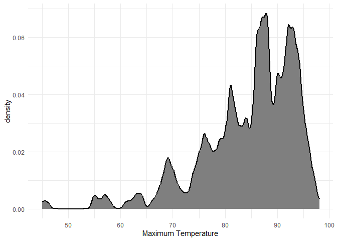
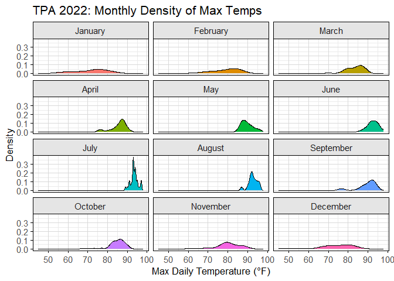
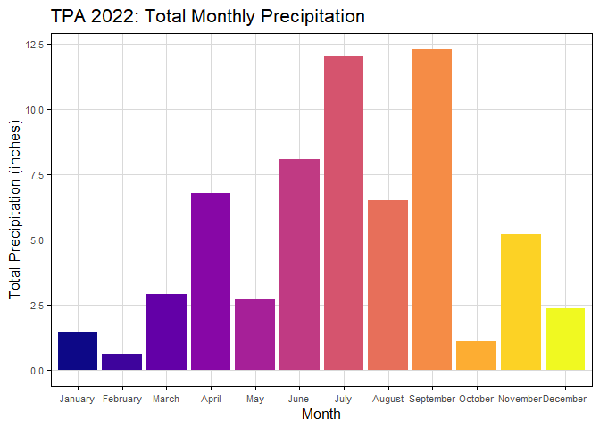
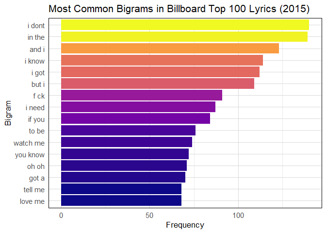

# Data Visualization Project 03

## PART 1: Density Plots

``` r
library(tidyverse)
library(ggridges)
library(viridis)
library(lubridate)
library(dplyr)
library(tidytext)

weather_tpa <- read_csv("https://raw.githubusercontent.com/aalhamadani/datasets/master/tpa_weather_2022.csv")
# random sample 
sample_n(weather_tpa, 4)
```

```
## # A tibble: 4 × 7
##    year month   day precipitation max_temp min_temp ave_temp
##   <dbl> <dbl> <dbl>         <dbl>    <dbl>    <dbl>    <dbl>
## 1  2022     9    17          0.06       92       75     83.5
## 2  2022     8    20          0.47       96       79     87.5
## 3  2022    10    26          0          83       69     76  
## 4  2022     3     8          0          86       74     80
```

Using the 2022 data: 

(a) Create a plot like the one below:


``` r
# Preprocess data with full month labels in order
tpa_clean <- weather_tpa %>%
  unite("doy", year, month, day, sep = "-") %>%
  mutate(
    doy = ymd(doy),
    max_temp = as.double(max_temp),
    month_label = factor(month(doy, label = TRUE, abbr = FALSE), levels = month.name)
  )

# Final plot
ggplot(tpa_clean, aes(x = max_temp, fill = month_label)) +
  geom_histogram(binwidth = 3) +
  facet_wrap(~ month_label, ncol = 4) +
  labs(
    x = "Maximum temperatures",
    y = "Number of Days"
  ) +
  theme_minimal(base_size = 13) +
  theme(
    # Facet headers
    strip.background = element_rect(fill = "grey85", color = "black"),
    strip.text = element_text(face = "plain", size = 11),

    # Panel border around each facet
    panel.border = element_rect(color = "black", fill = NA, linewidth = 0.5),

    # Grid lines: horizontal and vertical (both active)
    panel.grid.major.x = element_line(color = "gray85", size = 0.3),
    panel.grid.major.y = element_line(color = "gray85", size = 0.3),
    panel.grid.minor = element_blank(),

    # Axis styling
    axis.title = element_text(size = 13),
    axis.text = element_text(size = 11),
    axis.ticks = element_line(color = "black", size = 0.3),
    legend.position = "none"

  )
```

```
## Warning: The `size` argument of `element_line()` is deprecated as of ggplot2 3.4.0.
## ℹ Please use the `linewidth` argument instead.
## This warning is displayed once every 8 hours.
## Call `lifecycle::last_lifecycle_warnings()` to see where this warning was
## generated.
```

<!-- -->
(b) Create a plot like the one below:


``` r
ggplot(weather_tpa, aes(x = max_temp)) +
  geom_density(kernel = "gaussian", bw = 0.5, fill = "grey50", size = .8) +
  labs(x = "Maximum Temperature",
       y = "density") +
  theme_minimal()
```

```
## Warning: Using `size` aesthetic for lines was deprecated in ggplot2 3.4.0.
## ℹ Please use `linewidth` instead.
## This warning is displayed once every 8 hours.
## Call `lifecycle::last_lifecycle_warnings()` to see where this warning was
## generated.
```

<!-- -->
(c) Create a plot like the one below:


``` r
ggplot(weather_tpa, aes(x = max_temp, fill = factor(month))) +
  geom_density() +
  facet_wrap(~ factor(month, labels = month.name), ncol = 3) +
  labs(
    title = "TPA 2022: Monthly Density of Max Temps",
    x = "Max Daily Temperature (°F)",
    y = "Density"
  ) +
  theme_minimal(base_size = 13) +
  theme(
    strip.background = element_rect(fill = "grey90", color = "black"),
    strip.text = element_text(size = 11),
    panel.border = element_rect(color = "black", fill = NA),
    panel.grid.major = element_line(color = "gray85", size = 0.3),
    axis.title = element_text(size = 13),
    axis.text = element_text(size = 11),
    axis.ticks = element_line(color = "black", size = 0.3),
    legend.position = "none"  # optional
  )
```

<!-- -->

(d) Generate a plot like the chart below:


``` r
tpa_clean <- weather_tpa %>%
  unite("doy", year, month, day, sep = "-") %>%
  mutate(
    doy = ymd(doy),
    max_temp = as.double(max_temp),
    month_label = factor(month(doy, label = TRUE, abbr = FALSE), levels = month.name)
  )

# Ridgeline plot with correct legend title
ggplot(tpa_clean, aes(x = max_temp, y = month_label, fill = stat(x))) +
  geom_density_ridges_gradient(
    scale = 1.1,
    quantile_lines = TRUE,
    quantiles = 2,
    rel_min_height = 0.01,
    color = "black",
    size = 0.3
  ) +
  scale_fill_viridis_c(
    option = "plasma",
    name = "Max Temp (°F)") +
  labs(   x = "Maximum temperature (in Fahrenheit degrees)",
    y = "Month"
  ) +
  theme_minimal(base_size = 13) +
  theme(
    strip.background = element_rect(fill = "grey85", color = "black"),
    strip.text = element_text(size = 11),
    panel.grid.major = element_line(color = "gray85", size = 0.3),
    panel.grid.minor = element_blank(),
    axis.title = element_text(size = 13),
    axis.text = element_text(size = 11),
    axis.ticks = element_line(color = "black", size = 0.3)
  )
```

```
## Warning in geom_density_ridges_gradient(scale = 1.1, quantile_lines = TRUE, :
## Ignoring unknown parameters: `size`
```

```
## Warning: `stat(x)` was deprecated in ggplot2 3.4.0.
## ℹ Please use `after_stat(x)` instead.
## This warning is displayed once every 8 hours.
## Call `lifecycle::last_lifecycle_warnings()` to see where this warning was
## generated.
```

```
## Picking joint bandwidth of 1.93
```

<!-- -->

(e) Create a plot of your choice that uses the attribute for precipitation _(values of -99.9 for temperature or -99.99 for precipitation represent missing data)_.


``` r
precip_summary <- weather_tpa %>%
  filter(precipitation != -99.99) %>%
  mutate(
    month = as.numeric(month),  # 🛠️ Ensure month is numeric
    month_label = factor(month, levels = 1:12, labels = month.name)
  ) %>%
  group_by(month_label) %>%
  summarise(
    total_precip = sum(precipitation, na.rm = TRUE),
    .groups = "drop"
  )

ggplot(precip_summary, aes(x = month_label, y = total_precip, fill = month_label)) +
  geom_col() +
  scale_fill_viridis_d(option = "plasma", guide = "none") +
  labs(
    title = "TPA 2022: Total Monthly Precipitation",
    x = "Month",
    y = "Total Precipitation (inches)"
  ) +
  theme_minimal(base_size = 13) +
  theme(
    panel.border = element_rect(color = "black", fill = NA, linewidth = 0.5),
    panel.grid.major = element_line(color = "gray85", size = 0.3),
    panel.grid.minor = element_blank(),
    axis.title = element_text(size = 13),
    axis.text = element_text(size = 8),
    axis.ticks = element_line(color = "black", size = 0.3)
  )
```

<!-- -->

## PART 2: Most Common Bigrams

### Option (A): Visualizing Text Data


``` r
# Load the dataset
lyrics <- read_csv("https://raw.githubusercontent.com/aalhamadani/dataviz_final_project/main/data/BB_top100_2015.csv")
```

```
## Rows: 100 Columns: 6
## ── Column specification ────────────────────────────────────────────────────────
## Delimiter: ","
## chr (3): Song, Artist, Lyrics
## dbl (3): Rank, Year, Source
## 
## ℹ Use `spec()` to retrieve the full column specification for this data.
## ℹ Specify the column types or set `show_col_types = FALSE` to quiet this message.
```

``` r
# Basic bigram creation (no aggressive filtering yet)
bigram_counts <- lyrics %>%
  unnest_tokens(bigram, Lyrics, token = "ngrams", n = 2) %>%
  count(bigram, sort = TRUE)

# View top rows to verify it's not empty
print(head(bigram_counts, 10))
```

```
## # A tibble: 10 × 2
##    bigram     n
##    <chr>  <int>
##  1 i dont   140
##  2 in the   139
##  3 and i    123
##  4 i know   114
##  5 i got    112
##  6 but i    109
##  7 f ck      91
##  8 i need    87
##  9 if you    84
## 10 to be     76
```

``` r
# Take the top 15 bigrams only
top_bigrams <- bigram_counts %>%
  slice_max(n, n = 15)

# Plot
ggplot(top_bigrams, aes(x = reorder(bigram, n), y = n, fill = n)) +
  geom_col() +
  coord_flip() +
  scale_fill_viridis_c(option = "plasma", guide = "none") +
  labs(
    title = "Most Common Bigrams in Billboard Top 100 Lyrics (2015)",
    x = "Bigram",
    y = "Frequency"
  ) +
  theme_minimal(base_size = 13) +
  theme(
    axis.title = element_text(size = 13),
    axis.text = element_text(size = 11),
    panel.border = element_rect(color = "black", fill = NA, linewidth = 0.5),
    panel.grid.major = element_line(color = "gray85", size = 0.3)
  )
```

<!-- -->


